# 05 — Challenge a Friend: live duels and play-later challenges

**Status:** Proposed product and engineering specification; not implementation approval.  
**Revised:** 2026-09-22.  
**Ownership:** This document owns friend challenges only. Do not implement or rewrite proposals 01–04 or 06 as part of this feature.  
**Deliverable:** Guest-friendly live friend games—shared AI mystery and human-answer duels with one secret per player—plus asynchronous AI challenges, across the four existing geography modes, isolated from daily scores and progress.

## 1. Recommendation

Build this feature. The strongest idea is a shared mystery and shared clues: the question you ask changes what your friend knows. That creates a social deduction game, not just another leaderboard.

However, the previous document mixed a promising concept with unsafe example code and unmeasured performance/growth promises. This revision replaces those examples with explicit game rules, real integration points, failure handling, and independently verifiable delivery slices.

The entertainment loop should be:

**Finish a puzzle → invite a friend → make meaningful decisions together → understand the result → choose a rematch.**

Three priorities:

1. **Remove invitation friction.** A link, a name, and a ready button; no account required.
2. **Reward deduction rather than waiting.** Give the person asking a useful question a brief opportunity to act on it.
3. **Make another round worthwhile.** A fresh target, alternating starting player, session score, and a clear rematch invitation—not an unavoidable popup.

Live duels remain the headline experience. Play-later challenges are equally discoverable at creation because friends are not always online together. Neither path may be a dead button, placeholder, or simulated opponent.

**User-selected extension:** Add **Each player owns a secret** as a distinct human-answer live game. Both players know their own location and answer questions about it; neither knows the opponent's location. The player answers independently using five choices, with the normal game's AI answer/recommendation and explanation displayed privately beside the controls as non-blocking guidance. Visible revisions and an Admin-reviewed improvement pipeline are specified in §4.4. Shared-mystery and play-later paths remain available; human judgments do not silently replace their verified answers.

### 1.1 Decisions that differ from the original

| Original proposal | Recommended decision | Reason |
|---|---|---|
| Ask OR guess, immediately give opponent the turn | Ask, then optionally guess in a short exclusive window; direct guesses remain possible | Otherwise the person producing the decisive clue can hand the win directly to the opponent |
| Hard-coded keyword evaluator; unknown questions return No | Reuse the real planner/evaluator; unsupported is not false | A false clue ruins trust and the match |
| Sub-5 ms natural-language answers | Separate planner latency, fact execution, and network delivery budgets; measure each | Natural-language planning can call Gemini; SQLite lookup time is not end-to-end latency |
| No PostgreSQL access until game over | Persist accepted state transitions and action evidence transactionally | Reconnects, reports, async play, and honest results need durable state |
| Browser-supplied guest ID proves identity | Server-issued participant credentials; ID is never authority | Otherwise knowing an opponent's ID permits impersonation |
| Exact distance plus bearing after a wrong guess | Radar off by default; optional coarse clues only after balance checks | Distance and initial bearing from a known point reconstruct the target coordinates |
| Daily target optionally reused in live competition | Fresh challenge target; exclude today's target for that mode | A player who already solved daily has an unfair advantage |
| 20 questions plus unbounded passes | Bounded turn count, independent question count, final sealed guesses | Avoid stalled matches and unclear endings |
| Async time as a tie-breaker | Solve, guesses, questions; ties are allowed | An asynchronous player may legitimately pause or use another device |
| Guessed viral coefficient of 0.80 | Measure invitation and completion funnels | The earlier invite/conversion numbers were assumptions, not site measurements |
| Model cannot settle a vague or subjective question | In human-answer duels, the secret's owner answers with five choices and optional context | A person who knows the location can give a useful qualified answer without pretending it is a verified fact |
| Editing an answer replaces history | Append attributed answer revisions and explicitly handle affected guesses | Players must see what changed and cannot unlearn a spoiled clue |

These are proposed defaults, not claims that balance has already been proven. The shared-clue rule and the exclusive guess window need actual paired playtests before public release.

## 2. What already exists and what must be reused

Inspected against the repository during this revision. Line numbers can move; symbols are the integration anchors.

| Existing surface | Relevant behavior | Challenge integration |
|---|---|---|
| `client/src/components/ShareResultCard.tsx` | End-game reveal, sharing and next-game presentation | Add a Challenge a friend action after completion; retain existing share actions |
| `client/src/pages/HomePage.tsx`, `components/Header.tsx` | Discovery and navigation | One Play with a friend entry; do not duplicate a new global mode picker |
| `client/src/components/QuestionInput.tsx` | Freeform question entry | Reuse accessibility and pending behavior; no return of removed suggestion chips or input hints |
| `client/src/components/GuessInput.tsx` and regional equivalents | Entity selection | Submit canonical entity IDs, not exact-name free text |
| `client/src/components/History.tsx:30,64` | Valid explanations hidden during play; reports appear only after completion | Preserve the same visibility policy in challenge views, with stronger server-side filtering |
| `client/src/components/MapBox.tsx` | Reads and mutates `useGameStore` directly | Do not mount it unchanged inside a duel; extract an explicitly controlled map surface in a coordinated change |
| `client/src/stores/gameStore.ts`, `lib/guestHistory.ts` | Daily-keyed guest progress and completion/streak rules | Do not store challenges here or send their actions through daily guest sync |
| `server/countrydle/local_planner.py::analyze_question_for_local_plan` | Structured natural-language planning; may call an external model | Reuse rather than create a second keyword interpreter |
| `server/countrydle/local_answering.py::execute_local_plan` | Executes against local facts using a canonical country name | Reuse through a target-explicit adapter, outside daily-state CRUD |
| `server/local_kb_question.py` and regional `LOCAL_CONFIG` definitions | Other modes' planning and local evaluation | Use per-mode adapters; do not pretend all databases have country columns |
| `server/countrydle/local_kb/schema.sql` | SQLite uses `app_country_name`, `cca2`, `cca3`; continents are relational | The original `name`, `flag_code`, `continent`, `is_active`, `is_landlocked` query assumptions are invalid |
| `server/db/models/country.py` | PostgreSQL country identities | PostgreSQL and SQLite numeric IDs are not interchangeable |
| `server/db/__init__.py::AsyncSessionLocal` | Actual async database session factory | Use this, not the nonexistent `db.base.async_session_maker` |
| `server/utils/guest_session.py`, `server/report_tokens.py` | Existing signed guest/report capability patterns | Reuse signing conventions, with separate challenge purpose/audience and expiry |
| `server/answer_reports.py`, `client/src/components/AnswerReportsPanel.tsx` | Persisted answer evidence and admin review | Extend source handling for challenge actions without inventing daily question IDs |
| `client/nginx.conf`, `client/vite.config.ts` | Existing `/api` routing; no complete duel WebSocket upgrade path | Add and verify upgrades through every actual proxy hop |
| `server/Dockerfile`, `server/utils/app.py` | Uvicorn process and application lifecycle | Explicit single-owner live-room deployment and graceful draining |

Important distinctions:

- Existing generated explanations can name the answer. Hiding them with CSS or withholding their rendering is insufficient for multiplayer: omit them from live payloads.
- Local execution can be quick, but synchronous planner/network work must not block the ASGI event loop.
- A new React store alone is not a multiplayer authority. Browser state is only a view of server-owned state.
- The recent country-identity question behavior remains unchanged in daily games. A challenge-specific rule must prevent identity questions becoming free guesses in a two-life duel.

## 3. The player experience

### 3.1 Entry and challenge creation

Entry points:

- Daily result card: **Challenge a friend** below the result, before the next-puzzle footer.
- Home/navigation: **Play with a friend**, available without completing daily.
- Completed challenge: **Rematch** and secondary **Play later instead**.

Creation sheet:

1. **Play live** or **Play later**. One-sentence explanation for each.
   - For live: **We answer each other** or **AI answers a shared mystery**. Show whose secret is being guessed and who answers before anyone readies. Remember a player's last choice; do not silently change an existing room's rules.
2. Geography mode, preselected from the page the player came from.
3. Display name, prefilled from the account or a neutral guest name; editable before joining.
4. Single primary action: **Create invite** for live, **Play my challenge** for async.
5. Advanced live settings collapsed: standard 45-second turns or relaxed 60-second turns. The rules shown in the invitation must match the selected settings.

Do not put rank, rewards, a friend list, or account signup ahead of the invite. Do not claim a friend is online without an actual connected participant.

Live invites may be created by guests. Async invitations are shareable only after the creator's fresh challenge attempt is terminal and sealed.

### 3.2 Lobby that does not waste the host's time

- Two clearly labelled seats; display connection and readiness separately.
- Primary **Share invite** using the existing native share behavior; **Copy link** fallback; optional QR for people in the same room.
- Copy success only after clipboard success. Native-share cancellation is not a failure toast.
- Show game mode, answerer type, turn time, two guesses per player, and any optional radar setting.
- AI mystery rule: **Your questions help both players. After asking, you get a brief chance to guess.**
- Human-answer rule: **You know your secret. Answer your friend's questions honestly while trying to guess theirs. “Yes-ish” and “I don't know” are allowed.**
- Both players explicitly ready; three-second countdown begins only with two connected seats.
- If settings change, clear both ready flags and announce what changed.
- If a friend has not joined after 60 seconds, offer **Make a play-later challenge** without pretending the match has started. This creates a separate async challenge; it does not mutate a live match in progress.
- Empty lobby expires after 15 minutes. Full, expired, cancelled, and invalid invitations get distinct recovery screens with **Create a new challenge**.
- Link-preview crawlers and GET requests never claim the second seat. Joining requires an intentional POST.

### 3.3 Live arena

Desktop:

- Compact header: player names, two remaining guesses each, active player, turn number, countdown.
- Map/notebook on the left; chronological shared clue history on the right.
- Question and guess actions below the map, with one unambiguous primary submit.

Mobile:

- Active-player banner and countdown remain visible while the keyboard is open.
- Latest clue above the composer; full history and map accessible without losing typed text.
- No forced scroll if the player is reading older clues; show **1 new clue** instead.
- Guess confirmation names the selected entity. A map tap selects a candidate; it never spends a guess.
- Opponent's turn: disable submissions, not thinking. Players may privately mark the map, review clues, and prepare a draft.
- Map markings and draft text are private. Never broadcast hover position, candidate selection, or input text.

Feedback:

- Immediate local pending state, then server acknowledgement, then verified YES/NO.
- Shared timeline shows who asked, the original question, a safe interpretation label if needed, and YES/NO/unsupported as genuinely separate outcomes.
- The server emits only target-independent validation text during play. No raw explanations or retrieval context.
- One restrained turn-change sound, opt-in after user interaction; independent mute control.
- Optional small reaction set with rate limit, mute, and reduced-motion support. No free-text chat in this release.
- Do not announce every countdown tick through a screen reader. Announce turn changes and a small number of time warnings.

### 3.4 Result that invites another round

Use a results panel, not a blocking unscrollable celebration modal.

1. Correct verdict: **Solved**, **Won by knockout**, **Won by forfeit**, **Draw**, or **Match interrupted**. Never describe a knockout as solving first.
2. Target reveal and mode-appropriate facts from the pinned knowledge base.
3. Side-by-side questions, guesses and result. No fabricated skill rating.
4. Expandable shared timeline with full explanations now unlocked.
5. **Report answer** on eligible persisted question actions, only after the relevant game/attempt is over.
6. Primary **Rematch**. Secondary **Share result** and **Back to daily**.
7. Small session score, such as **You 1 — Sam 1**, labelled as this session only.

A rematch requires both players' consent, swaps the opener, picks a new target, and preserves the session score. Simultaneous rematch requests create one next match, not two. Declining never traps the other player.

A spoiler-free share card may include names, geography mode, result and session score. Do not include the target, flag, exact clues, replay access, or private credentials in the default share image or link preview.

## 4. Recommended live rules: precise contract

Sections 4.1–4.3 define **AI shared-mystery** rules. Section 4.4 defines the selected **human-answer, two-secret** variant and overrides target ownership, question resolution, answer timers, uncertainty and correction behavior. Identity, durable state, guess validation and post-game reporting remain server-enforced in both variants.

### 4.1 Defaults

| Rule | Default |
|---|---|
| Seats | Exactly two; no spectators |
| Geography | Countrydle, US states, voivodeships, powiaty through explicit adapters |
| Target | Fresh random eligible entity, same for both players; not today's daily target for that mode |
| Opener | Server-selected random opener; alternate on rematch |
| Thinking clock | 45 seconds; optional 60-second relaxed preset, fixed before readiness |
| Question allowance | At most one accepted question per turn |
| Guess allowance | Two guesses per player for the match, including any final guess |
| After answering | Asking player receives an exclusive 8-second optional guess window |
| Ordinary turns | Maximum 12 total turns, including passes and timeouts |
| Match wall-clock ceiling | 10 minutes from the start, including pauses; transition rules below |
| Final round | Simultaneous sealed guesses, 30 seconds, only unused guess allowance |
| Disconnect grace | 30 seconds total per participant per match, not per reconnect |
| Matchmaking/ranked score | Private/unlisted only; no public rating or daily score effect |

The 12-turn and 10-minute bounds are safety limits, not a promise that every match should be that long. A 3–6 minute median is a product hypothesis to test. The original 20 × 45-second thinking allowance alone was 15 minutes, before evaluation and disconnect delays.

### 4.2 One ordinary turn

```mermaid
stateDiagram-v2
    Thinking --> Resolving: Submit one question before deadline
    Thinking --> TurnFinished: Direct wrong guess, pass, or timeout
    Thinking --> Finished: Correct direct guess or knockout
    Resolving --> GuessWindow: Valid verified answer
    Resolving --> Thinking: Unsupported question; remaining thinking time restored
    Resolving --> Interrupted: Repeated service failure
    GuessWindow --> TurnFinished: Skip, timeout, or wrong guess with life left
    GuessWindow --> Finished: Correct guess or second wrong guess
    TurnFinished --> Thinking: Opponent's turn
    TurnFinished --> FinalRound: Turn cap or match ceiling reached
    FinalRound --> Finished: Both sealed guesses resolved or final deadline
```

- Submit a question before the server deadline: reserve the action and freeze that turn's remaining thinking budget while the answer is being evaluated.
- On a valid answer, broadcast the clue to both players. Only its asker can guess during the following eight seconds. **Pass to Sam** can end that window immediately.
- A direct guess does not also allow a question. A wrong guess consumes one life and ends the turn.
- The opponent cannot steal the guess window. They can prepare privately for their next turn.
- Two wrong guesses eliminate the player immediately; the other player wins by knockout.
- Unsupported questions do not become No and do not consume a life. Allow two repair attempts within the same remaining thinking budget; a third unsupported submission ends the turn. Explain the limit before the final repair.
- Malformed payloads are rate-limited protocol errors, not free planner calls.
- An exact repeat of an already answered question points to its existing clue and does not call the planner or reset the clock.
- An identity question such as “Is it France?” is routed to a **Confirm guess: France** response before evaluation. It gives no answer until explicitly confirmed as a life-spending guess. Use canonical planned identity semantics, not only a list of English phrases. Daily identity questions retain their current behavior.
- Validation must also reject singleton target-selection predicates disguised as free questions where the planner explicitly represents entity identity. Normal geographic deduction may still narrow to one entity; do not attempt to prohibit all informative questions.

### 4.3 Endings and fairness

- Correct ordinary guess: immediate win.
- Second wrong ordinary guess: opponent wins by knockout, even if they had not solved the target.
- Two consecutive full thinking-turn timeouts by one player: forfeit. Deliberate passes are allowed but consume the finite turn budget.
- After 12 ordinary turns: enter the final round.
- At the 10-minute match ceiling: stop accepting new ordinary actions. An already reserved action may resolve within its bounded evaluation timeout; a winning reserved guess takes precedence. Otherwise enter the final round without an extra guess window.
- If the ceiling is reached while a participant is disconnected but still inside their grace budget, end as interrupted/no-contest rather than forcing an unseen final guess. An already expired disconnect grace takes precedence and remains a forfeit.
- Final guesses remain sealed until both submit or the 30-second final deadline. Each submission uses one remaining life; no extra life is granted.
- Exactly one correct final guess wins. Both correct is a draw. Neither correct is a draw; do not crown the faster wrong guess. A missing final submission is an incorrect final outcome, not an automatic opponent win if they also fail.
- Both players disconnected through the remaining grace period: abandoned/no-contest, not a phantom victory.
- A match interrupted by server/database/model failure is not a player loss. Preserve evidence and offer a fresh rematch.

There is no claim that shared-clue play is first-move neutral. Randomize the first opener, alternate rematches, record opener win rates, and compare the protected guess window with strict alternation during internal playtests. Do not ship multiple near-identical timer/rule experiments just to avoid choosing. The user-selected human-answer game below is a genuinely different two-secret social experience, not such an experiment.

### 4.4 Human-answer duels: each player owns a secret

**Selected by the user.** This adds human judgment and conversation without giving someone the answer they are supposed to guess.

#### A. Secret ownership and victory

- Each player privately chooses **Choose my country** or **Random country** before readying. For regional games, use the equivalent state/voivodeship/county label. Alice owns her selection; Bob owns his.
- **Choose my country:** use the existing searchable canonical entity picker, then confirm the selected location. Choosing a place the owner knows well is encouraged; this is a casual friend game, not a claim of equal target difficulty.
- **Random country:** the server selects from the same public geography pool and shows the result only to its owner. The owner can keep it, request another random choice, or switch to manual selection while the lobby is unlocked. Rate-limit random requests and make retries idempotent; refresh/reconnect must not reroll.
- Both players may choose independently: manual/manual, random/random or mixed. The opponent sees only **Choosing a secret** or **Secret ready**, never selection text, suggestions, search terms, random previews or the chosen entity.
- Ready requires a confirmed valid secret. Unready/change-secret before countdown clears readiness. Starting the countdown atomically locks both targets and their versions; later selection/reroll commands are rejected without changing the match. A cancelled countdown returns to the lobby and requires fresh readiness before any revised choices can start.
- Allow both players to independently choose the same country. Never reject a choice because it matches the opponent's secret: that would leak their target. There are two separately owned target records, not a requirement for different entities.
- Human-choice eligibility is the public supported geography pool, not a target-dependent secret exclusion list. Do not reject a manual selection because it is today's hidden daily country, or filter random human choices using the opponent's secret. Human games remain separate from daily progress; AI-shared and async games keep their fresh-target exclusion rules.
- On rematch, return both players to private selection with nothing automatically confirmed. Random selection avoids the previous revealed targets when the public pool permits; manual selection may deliberately reuse a familiar location. No opponent secret is exposed through availability or error messages.
- Alice may see only Alice's secret and its owner-only fact sheet. Bob asks about Alice's secret; Alice asks about Bob's secret.
- Server stores both targets and checks guesses. A player cannot mark a correct guess wrong, change the secret, or award themselves a win.
- Each player has two guesses against the opponent's target. First correct guess wins; a second wrong guess loses by knockout. Alternate who asks first on rematch.
- At the ordinary-turn/match ceiling, sealed final guesses target the opponent's respective secret. Both correct or neither correct is a draw, as in §4.3.
- On terminal match state, reveal both secrets, clearly labelled by owner.
- This is a casual, trust-based friend game. The server can enforce identities, timing and exact guesses; it cannot prove that “known for music” is objectively true or that the owner is being honest.
- Human-answer rooms are live only. Play-later challenges stay AI-resolved; they do not unexpectedly wait for an offline owner to reply.

#### B. Five answers, with words rather than misleading numbers

| Stored value | Player label | Meaning | Example context |
|---|---|---|---|
| `yes` | Yes | I would answer this affirmatively | “Yes, it has a coastline.” |
| `mostly_yes` | Yes-ish / Mostly yes | Generally yes, with a meaningful qualification | “Yes for its musical traditions, not necessarily modern pop.” |
| `mostly_no` | No-ish / Mostly no | Generally no, although an exception exists | “Not especially, but it has one famous annual festival.” |
| `no` | No | I would answer this negatively | “No, it does not border that country.” |
| `unknown` | I don't know | I cannot give you a reliable answer | “I'm not sure how well known it is internationally.” |

- These are semantic answers, not confidence scores. “Mostly yes” must not become `true`, `0.75`, or a model probability.
- Human answers always carry **Answered by Alice**, even when Alice accepted an AI suggestion. Do not mark them verified by the knowledge base.
- Require a brief 1–200-character qualification for both “-ish” answers. Context is optional for Yes, No and I don't know.
- The UI presents labelled buttons, not only colors or icons; use amber/neutral treatment for qualified and unknown answers, not the binary red/green styling.
- The five human answer controls are available immediately. The normal game's AI recommendation and explanation load beside them, privately, without requiring an accept/reject step or delaying submission. No answer is auto-selected or auto-published.
- No human answer—including Yes or No—automatically changes the authoritative candidate map. Human judgments are not verified elimination predicates. Private manual marks remain available.
- Existing daily questions and AI-mystery answers keep their boolean contract; add a discriminated human-answer outcome, not a global replacement of `Question.answer`.

#### C. Player answers independently; normal-game AI guidance appears alongside

The primary answering area shows **Your secret**, **Friend's question**, the five answer choices and **Send answer**. It works immediately, even while the AI is loading or unavailable.

Beside it, an **AI recommendation — only you can see this** panel shows:

1. The answer returned by the normal game's answering pipeline for this question and this owned secret.
2. The normal game's actual factual explanation, available source references and interpreted question—not a separately generated persuasive justification.
3. A clear source/status: local facts, configured normal-game fallback, unsupported, loading or unavailable. AI confidence is not converted into Yes-ish/No-ish.

Reuse the existing per-mode answering/explanation functions through a target-explicit, non-daily-persisting adapter, including the normal configured fallback where applicable. Do not call the current-day HTTP endpoint, change a daily score, or implement a second question engine. The owner may agree, disagree or ignore the recommendation.

Desktop places guidance next to the answer controls. Mobile puts a compact recommendation card directly below them, with expandable explanation; loading or expanding it must not move the selected answer or obscure Send. No suggestion is preselected.

Example:

- Bob asks Alice: **“Is your place known for music?”**
- Alice privately sees her secret and **Cannot verify this — the current facts do not establish what ‘known for music’ means.** This is an unsupported explanation, not an invented Yes/No answer.
- Alice selects **Yes-ish**, adds the private reason **“It has a strong folk tradition, but the wording is subjective”**, and a short public qualification **“Yes for traditional music; not necessarily modern pop.”**
- Bob sees only **Alice answered Yes-ish** and the public qualification during play. Full AI explanations may unlock after the match; Alice's private correction reason stays restricted to Alice and authorized Admin reviewers, not her opponent.

Rules:

- Request one real AI recommendation automatically when a question arrives. Owner answer controls remain enabled throughout the request; no “Check with AI” action is needed.
- Start the owner's 30-second answering clock when the question is delivered, independently of the recommendation request. AI completion, timeout or failure never resets it. The asker is not losing their thinking budget during this phase, and the match ceiling still applies.
- If an answer arrives without an explanation, show **Explanation unavailable** rather than inventing one. The owner can still answer normally.
- Submitting a matching human value means **agrees with suggestion**, not “accepted/verified AI.” Do not infer that the owner read or endorsed the explanation.
- The owner may choose any of the five answers immediately. A private **AI answer/explanation seems wrong** note is optional and never blocks gameplay; only an explicit note/dispute counts as a reported AI correction. The usual short public qualification remains required for Yes-ish/No-ish.
- Capture explanation-only disagreements even if the player's Yes/No answer matches. A difference in values alone is a disagreement candidate for review, not proof of an AI defect.
- Public context remains a separate, clearly labelled 200-character field. It is required for Yes-ish/No-ish and optional otherwise. Never prefill it with a private explanation that might name the target.
- Loading, unsupported and unavailable statuses never disable the five choices. I don't know remains a legitimate voluntary response, distinct from any service failure.
- A late recommendation may be retained as separate diagnostic evidence but must not change the human answer, insert a second review case, reset a timer, or open a new active-turn prompt. Label it **Arrived after your answer** in the owner's completed clue details.
- Human changes apply immediately to this match's answer, with the revision safeguards below. They become proposed improvement evidence for the real game, not automatic changes to global facts or model behavior.

#### D. Asking, answering and clarifying

Human turn phases: **asking → owner answer (AI guidance loads concurrently) → optional clarification → guess window → next asker**. Recommendation generation is not a blocking gameplay phase.

- Asking player has the selected 45/60-second thinking clock to submit a question, make a direct guess or pass.
- On a submitted question, freeze the asker's clock and immediately give the owner 30 seconds to answer. Launch bounded AI guidance independently against the owner's secret. The question is explicitly bound to `subject_participant_id`; timelines must not mix clues about the two secrets.
- The owner's answer produces the usual eight-second optional guess window for the asker, even for I don't know. There is no life penalty for an uncertain answer.
- Each new submitted question consumes that turn's one question opportunity. I don't know does not grant unlimited free replacement questions or secretly count as a question the model rejected.
- Both parties can request **one clarification per question in total**, before the next turn starts: the owner may ask what a term means; the asker may request context for the submitted answer. A short question-linked prompt/reply is limited to 200 characters each, with a 15-second response deadline.
- On clarification, freeze the current answer/guess phase with its remaining budget. Resume it after the reply or deadline; do not reset a full 30-second answering clock repeatedly.
- If the owner fails to answer by their deadline, publish **No answer received** with provenance `timeout`, not **Alice answered I don't know**. This is distinct from the five intentional answer values.
- The first answering timeout ends that turn without charging the asker a guess. Two consecutive answering timeouts by that owner cause forfeit; a deliberate submitted answer resets that timeout streak.
- Existing finite disconnect grace applies. A dropped answering player does not cause the asker to lose their thinking time.
- The ten-minute wall-clock ceiling still bounds answering and clarification delays. Once reached, reject new answer/helper/clarification actions and enter the sealed final round; an already accepted exact guess or expired forfeit takes precedence. Unanswered questions are recorded as unresolved, not false.
- Broad and subjective questions are welcome here. Exact identity questions still require server-validated guess confirmation, rather than allowing unlimited free attempts to name the opponent's secret.

#### E. Corrections during play are not post-game reports

There are two different controls:

- **Correct my answer:** only the secret's owner can revise their own submitted human answer during the match.
- **Report answer:** the existing-style dispute/evidence submission, available only after the match is over.

Correction behavior:

1. Select the affected clue, choose a new value and add a required reason of 1–200 characters.
2. Server checks the owner, subject, match state and expected answer revision, then appends a revision. It never silently overwrites the old answer or edits someone else's question.
3. Both players see **Alice corrected No → Yes-ish**, the reason, timestamp and a visible revision badge. The current answer is prominent; earlier versions remain expandable.
4. An unaccepted AI suggestion is a private draft, not a public answer. Changing it before first submission does not create fake public correction history.
5. No automatic map eliminations or life changes follow a correction.

Fairness after a correction:

- If the question is still in its current answer/guess phase and no later guess has been accepted, show the correction and preserve the asker's remaining guess-window budget while they read it.
- If any subsequent guess was accepted, pause normal gameplay for **Continue with correction** or **Void and rematch**, chosen by the affected guesser. Unanimous consent is required to count the remainder as an ordinary scored match; the affected player can instead end it as no-contest.
- This intentionally does not try to determine whether the wrong answer “caused” a guess. That cannot be established reliably from the log.
- Do not auto-refund a guess or rewind turns: players cannot unlearn information already revealed. A void match contributes no session win/loss; a rematch uses fresh secrets and still requires both players' agreement.
- A correction-consent decision has a 15-second deadline; no response ends the match as no-contest rather than silently accepting the correction.
- Informational reading pauses for corrections have a 30-second cumulative room budget. Corrections remain possible afterward, but cannot keep extending the clock; repeated changes can always be handled by ending the match unscored.
- Match state and answer revisions serialize correction/guess races. A guess committed before a correction is treated as subsequent play for this policy; a stale guess referencing an older clue revision is rejected without spending a life.
- After a terminal win/knockout/final verdict, no live correction can rewrite that outcome. Allow a post-game report/addendum and offer a fresh rematch; preserve the original result and mark disputes explicitly.

The owner may intentionally or accidentally include the secret name in their human-written explanation. Warn against this, detect obvious canonical-name/alias matches as a courtesy, and require confirmation before sending them. This is not a complete spoiler or honesty guarantee. The opponent can choose a no-contest exit if the secret was spoiled; server-derived target disclosure must still be prevented absolutely.

#### F. Protocol, persistence and visibility extensions

- Match `answer_mode`: `ai_shared` or `human_owned`, immutable after readiness; async permits only `ai_shared`.
- Represent targets separately in `friend_targets`: match ID, subject key (`shared` or a participant ID), canonical entity key and pinned fact revision. Validate exactly one shared target or one confirmed owned target per participant before starting; human-owned entities may coincide. Store selection source (`manual`/`random`), selection version and lock timestamp. Do not leave an ambiguous single `target_id` authoritative in human games.
- Human-lobby commands `select_secret` and `randomize_secret` require participant authorization, idempotency and expected lobby/selection version. Only the caller's target can change. Canonical eligibility checks are server-side and independent of the opponent's secret; ready/countdown races serialize with selection updates.
- Add `subject_participant_id` to human question/guess actions and `answer_revision` to the clue record. Add append-only `friend_answer_revisions` with author, value, context, reason, prior revision and timestamp.
- Keep `public_revision_reason` (up to 200 characters, shown to both players on a live correction) separate from `private_review_reason` (up to 500 characters, owner/Admin only). An initial correction of an unpublished AI draft is an owner review, not a public history revision.
- Outcomes are discriminated: `verified_boolean`, `human_answer`, `unsupported`, `answer_timeout`, and `provider_failure`. Only `human_answer` has the five-value semantic enum; timeout/failure is not an intentional I don't know.
- Human commands: `answer_question`, `request_clarification`, `reply_clarification`, `correct_answer`, and `resolve_correction`. Each uses action idempotency plus expected match/phase/answer revision. `answer_question` allows a null `observed_ai_draft_id`; any supplied ID must belong to this question and owner. There is no mandatory `accept_ai_answer` command.
- Persist the recommendation request/status/deadline and immutable result separately from the owner answer. Snapshot any observed draft ID and display acknowledgement at submission, plus clarification use/deadline, correction consent, read-pause budget and answering-timeout streak. Reconnect restores state without resetting budgets or fabricating observation.
- Human viewer snapshot is **shared state + your own secret sheet + your own private AI suggestion**. Neither opponent credentials nor opponent secret/helper output may be returned. The original single public snapshot must not be sent identically to both players.
- Keep private helper explanations distinct from safe human-authored context in DTOs. The former must never be broadcast, even if the owner selected Yes.
- Audit reports capture the complete revision chain and distinguish **human judgment disputed** from **AI suggestion disputed**. They are not unverified corrections to the canonical knowledge base.
- Automatic AI guidance shares bounded provider capacity. Loading, capacity rejection and service failure only affect the private guidance status; independent human answering remains available.

#### G. Human-game delivery slices and acceptance checks

These are additional required slices after core identities/targets and before launch; they are not optional polish:

- **H1 — Select and hide owned secrets.** Add manual/random private selection, `answer_mode`, subject-bound targets and viewer projections. Proof: all manual/random combinations work in two isolated browser contexts; same-country choices succeed without disclosure; invalid IDs and cross-seat changes fail; reroll retries/reconnect do not change the selection twice; countdown freezes both targets; guesses always test the opponent's locked entity.
- **H2 — Submit five attributed human answers.** Add the answer picker, qualified context and typed persistence. Proof: each value round-trips without boolean coercion; a non-owner cannot answer; no value automatically removes map candidates.
- **H3 — Show normal-game AI guidance without gating answers.** Reuse the actual per-mode answer/explanation pipeline in an owner-only side panel. Proof: the player can submit before AI completion, during failure, or with a different value; no selection is prefilled; opponent frames contain no private explanation; late results never change the answer or timers.
- **H4 — Resolve human phases and clarification.** Add bounded response time, one question-linked clarification and truthful timeout events. Proof: owner thinking/disconnection does not spend the asker's clock; deliberate unknown and answer timeout remain different outcomes.
- **H5 — Correct visibly and handle affected guesses.** Add append-only revisions, correction notices and continue/no-contest negotiation. Proof: duplicate/stale corrections, correction-versus-guess races and reconnects cannot erase history, consume extra lives or bypass consent.
- **H6 — Finish and review both secrets.** Add dual reveal, report source/provenance, revision history and fresh-secret rematches. Proof: reports appear only post-game, human claims never modify canonical facts, and void matches do not increment the session score.
- Playtest all four geographies with a subjective question, an I don't know, a clarification and an actual answer correction. Confirm that both players know which secret each clue describes.
- **H7 — Turn human answers and explicit feedback into reviewed evidence.** Save the owner answer with its observed recommendation snapshot, allow separately timestamped late AI evidence, and provide an Admin improvement queue. Proof: unseen AI is never classified as accepted/corrected; explanation-only disputes are captured; duplicate submits create one case; unreviewed differences cannot alter daily answers.

#### H. Feedback loop: improve the real game without blindly trusting corrections

**Purpose:** Use real friend questions and owner reviews to discover where the daily question system misunderstands language, lacks facts, evaluates incorrectly or explains badly.

Record every explicitly submitted owner answer and its AI-observation snapshot in the same transaction as the gameplay answer. Store recommendations that arrive later separately without rewriting what the player saw at submission.

| Evidence | Required contents |
|---|---|
| Original request | Exact question, language, geography mode, subject's canonical target and match/action IDs |
| AI interpretation | Displayed interpreted question, structured query plan and relation/operator when available |
| AI result | Immutable draft ID, supported/unavailable status, proposed answer, actual factual explanation, fact/source references, failure classification |
| Reproducibility | Model identifier, prompt/schema/evaluator/rule versions, fact-bundle revision, server version and evaluation timestamp |
| Human decision | Five-value answer, optional private dispute/reason, public qualification, owner and submission timestamp; decision origin remains human. Separate comparison status: `agrees`, `differs`, `no_suggestion_observed`, `suggestion_unsupported`, `suggestion_unavailable`, or `not_comparable` |
| Later changes | Full append-only revision chain, correction consent/no-contest state and any post-game reports |
| Recommendation exposure | Nullable observed draft ID, server produced/sent timestamps, client-render acknowledgement when available, answer submission time, explanation expansion acknowledgement and late-result marker; these are observation signals, not proof the owner read or understood the text |

- Store displayed factual explanation and structured plan, not hidden model reasoning or credentials. Human explanations are untrusted text; they must never become system instructions for a later model call.
- Preserve both the AI draft and the human response. Never replace the AI output with the correction or lose the evidence needed to reproduce the error.
- Human answers and apparent agreement are not verified truth. Even a rendered recommendation may not have been read; never label matching values as explicit acceptance or treat them as independently collected ground truth.
- With an observed supported boolean, human Yes/No can agree/differ. Yes-ish, No-ish and I don't know are `not_comparable`, never coerced into booleans. Explicit explanation disputes are recorded independently of this comparison.
- Surface explicit disputes, qualified judgments and disagreement/unsupported candidates in Admin after the match is terminal. Label unprompted answers and late/unseen AI comparisons distinctly; routine matches stay out of the issue queue. Observation metadata is client-reported and not trustworthy evidence of honesty.
- Corrections enter this queue automatically when submitted in gameplay. Players should not have to submit a second post-game report to make the feedback usable. The separate Report answer action remains post-game only.

Admin review flow:

1. **New:** compare original question, interpretation, AI answer/explanation, pinned target facts and human correction side by side.
2. **Triage:** classify as wrong interpretation, missing/wrong fact, evaluator defect, misleading explanation, subjective/ambiguous question, technical failure, unsupported domain, mistaken human correction or abuse. Keep unresolved cases explicitly unverified.
3. **Verify:** check authoritative evidence or reproduce against the pinned fact/planner version. Similar corrections can suggest a pattern; majority votes do not prove a fact.
4. **Decision:** `confirmed`, `needs_evidence`, `subjective`, `rejected`, or `duplicate`; attach reviewer identity, rationale and reference to any related case.
5. **Fix:** link the confirmed case to the exact prompt/parser, fact-data, evaluator or explanation change. A reviewed daily fact change must use the existing audited fact-edit workflow; do not directly write from a duel response.
6. **Verify and release:** test the original question plus relevant variants and protected counterexamples, then mark the case `fixed` with the release/change reference. Admin clicking “confirmed” does not deploy anything.

Examples of different fixes:

- **Wrong interpretation:** “Does it border X?” was interpreted as “Is it X?” → fix planning/prompt rules; test both intents, negation and Polish wording.
- **Wrong fact:** a verified border/capital/language record is outdated → update the fact source through the audited data path, not a question-specific exception.
- **Wrong execution:** a correct plan evaluated a list or unary operator incorrectly → fix the evaluator and retain a behavioral regression.
- **Bad explanation:** the boolean is correct but the explanation cites an unrelated fact → fix the explanation builder; no need to relabel the boolean.
- **Subjective music question:** the owner gives Yes-ish → useful evidence for unsupported-question guidance or a separately defined new relation, not permission to add an unqualified `known_for_music=true` to daily facts.

Engineering evaluation:

- Approved cases form a versioned, redacted regression/evaluation corpus. Unreviewed human values never become binary ground-truth labels.
- Separate related paraphrases/matches when selecting development versus held-out evaluation examples; otherwise repeat questions make improvements look better than they are.
- Measure interpretation correctness, verified-answer correctness, unsupported handling and explanation quality separately, including per-mode/per-language results.
- Keep a fixed existing-behavior evaluation set so improving one corrected question does not regress other relations. Do not tune only to accepted corrections.
- No automatic fine-tuning, self-training, production prompt edits or cross-game fact updates. Any later training/export program requires its own consent, privacy and quality policy.

Data and schema:

- Add `friend_answer_reviews`, keyed uniquely by question action, owner answer revision and AI draft/preparation attempt. It references the immutable draft, decision, private reason and reviewer workflow; idempotent answer retries cannot multiply cases.
- Document this QA use to players: **“Your answer reviews may help us improve question answering. Corrections are reviewed before changing the game.”** Keep private reasons visibly distinguished from notes shared with the friend.
- Existing match evidence retention applies unless a case is explicitly retained for review under the published report policy. On retaining a case, copy the minimal reproducible evidence into its review record before match cleanup.
- Remove participant names, invitation codes, account/device identifiers and unrelated free text from approved evaluation exports. Retained derived examples must follow the stated deletion/erasure policy; account erasure cannot leave identifying JSON snapshots behind.
- Admin access is permission-gated and audited. Improvement data is operational QA content, not raw-question analytics sent to third-party trackers.

## 5. Radar and map deduction without spoiling the game

The original “no coordinates in the payload” rule is not enough. A precise distance and initial bearing from a known guessed point can be inverted into a target point. A simple forward/inverse spherical calculation during this review recovered a target at (10°, 20°) from a guess at (0°, 0°) to floating-point precision.

Therefore:

- Standard duel: radar off. The wrong entity is still publicly recorded and both players know it is excluded.
- Optional **Guided duel** may use coarse distance bands and eight compass sectors. It must be labelled in the lobby and use the same setting for both players.
- Starting distance bands, subject to dataset enumeration: countries/states `<500`, `500–1500`, `1500–4000`, `4000+ km`; counties/voivodeships `<25`, `25–75`, `75–200`, `200+ km`.
- These bands are hypotheses, not proof of non-disclosure. Enumerate all guess/target pairs for each geography before enabling them. On a small entity pool, even a coarse pair can identify one candidate.
- If guided mode regularly collapses to one candidate after the first wrong guess, widen/omit the direction or keep the mode disabled. Never secretly vary clue precision based on the actual target.
- No exact distance, bearing degrees, target centroid, or target-dependent map geometry in pre-result frames.
- Coordinate convention must be explicit: geographic centroid versus capital, not an unexplained mixture. Direction means from guess toward target; identical points have no meaningful bearing.
- Proposal 06 owns shared geometry calculations. Reuse its eventual helper, but challenge output precision and hint policy remain separate. Do not implement a second Haversine module inside `server/duel/`.
- Proposal 03 owns automatic visual elimination. Until its public contract exists, use private manual markings only. Do not advertise an exact “countries remaining” count without a verified candidate-set calculation.

## 6. Play-later challenges: a complete second path

### 6.1 Creation and invitations

1. Creator selects **Play later**, mode, and the standard challenge rules.
2. Server creates a fresh challenge and a creator attempt. It does not import a localStorage daily score or let the creator supply the target.
3. Creator plays to completion or failure with the existing mode's normal question/guess limits, snapshotted when created. No live turn clock, no live knockout scoring, and no distance hint unless both attempts share an explicitly frozen rule.
4. Server seals the creator result. Only then is the invitation shareable.
5. Recipient intentionally claims the second seat and plays the same target/rules/fact revision without access to the creator's moves or result details.
6. Both terminal attempts unlock the comparison for both participants. If the recipient finishes first after a resumed creator flow, comparison still waits for both terminal attempts.

The challenge is a private one-to-one match. Multi-recipient competitions, public rooms and user-selected trick targets are separate future features, not hidden assumptions.

Do not reuse today's daily target or claimed guest daily performance. This avoids already-solved spoilers and unverifiable client scores. Copy explains: **A fresh puzzle for you both. Your daily progress stays unchanged.**

### 6.2 Async scoring and disclosure

Comparator, evaluated on the server:

1. Solved beats failed.
2. If both solved: fewer guesses wins.
3. Then fewer valid questions wins.
4. Equal values are a draw.
5. Both failed is a draw. Show descriptive statistics, not a fake winning result.

Elapsed active time can be displayed with a clear definition, but is never the tie-breaker. Opening a link, phone calls, accessibility tools and pauses must not punish an async player.

Before one's own attempt is terminal, neither target nor full explanations are returned to that participant. A creator who has finished can view their own reveal but cannot read the recipient's ongoing draft/actions. The recipient cannot request the creator's reveal through another endpoint. Public invitation/OG metadata contains neither result nor target.

### 6.3 Persistence, expiry and return visits

- Invitation expires seven days after creator completion. Creating a draft without playing does not reserve storage indefinitely; unfinished creator drafts expire after 24 hours.
- A recipient who starts before invitation expiry receives 24 hours to finish from their start time. State this on the landing page.
- Refresh, browser restart, and same-device return resume the server-owned attempt. Local storage may preserve unsent drafts, never authoritative results or lives.
- Same-device guest play works without registration. Explicit optional account linking enables cross-device access. Losing all guest credentials cannot be fixed using a public name or invitation code.
- Completion appears in an in-site **Your challenges** list for authorized participants. Guests see challenges accessible to their browser session; account users can see linked challenges across devices.
- No unsolicited email/push notifications. Add opt-in notifications only as a separate consented feature.
- Creator can revoke an unclaimed invitation. After the recipient starts, neither player can reset the target or rewrite a sealed result.
- Repeated POSTs cannot create extra attempts. Rematch creates a fresh challenge with the recipient as the next creator.
- Pin the relevant fact bundle and rule version for both attempts. Retain that bundle until the last allowed attempt expires; do not let a deployment change answers halfway through a seven-day challenge.

## 7. Authority, identity and spoiler boundary

### 7.1 Identities and capabilities

Separate these values:

- `invite_code`: discover/join an unlisted invitation; never identifies an existing participant.
- `participant_id`: public stable seat identifier, safe to display in match events.
- `participant credential`: server-issued secret authorizing that seat; never in broadcasts or share URLs.
- Existing account ID: optional linked identity obtained from verified authentication, never from JSON fields.

Recommended implementation:

- Reuse the existing signing configuration/conventions with a dedicated challenge token purpose/audience; do not reuse a daily guest token unchanged.
- Prefer a scoped, Secure, HttpOnly, SameSite cookie for guest participant credentials. Scope credentials so one room cannot replace another room's credential.
- If the transport needs a ticket, mint a short-lived, single-use WebSocket ticket over authenticated HTTP and send it as the first authentication message. Do not put long-lived access tokens in query strings, logs, analytics or QR codes.
- Authenticate within a short timeout before accepting any gameplay command. Validate WebSocket Origin explicitly; CORS alone does not secure WebSockets.
- HTTP mutations require same-origin/CSRF protection appropriate to the chosen cookies. Rate-limit create, join, ticket minting and guessed room codes.
- A second tab for the same seat receives an explicit takeover choice or read-only session. Use a connection generation so closing an old socket cannot mark the newer socket disconnected.
- Room codes use a cryptographically secure generator and database uniqueness. Prefer 10 unambiguous base32 characters, displayed in groups, rather than the original six-character roughly 30-bit code. Rate limits remain required.
- Cap display names and text lengths; render as text, never HTML. Avoid leaking account profile data through the invitation.

### 7.2 Public and private state must be different schemas

Private server state includes target identities, fact revisions, raw AI explanation, retrieval/evaluator context, internal errors, guest credentials and sealed final guesses. In `human_owned` games, the owner is authorized to receive their own target/fact sheet and private helper output through a separate viewer-specific projection; the opponent is not.

Public live snapshot contains only:

- Match ID, rule version, mode, room state/version and server time.
- Safe player display fields, readiness, connection state and lives.
- Active seat, turn/phase IDs, deadlines and safe action acknowledgements.
- Original question text, safe interpretation if available, and a discriminated result: verified boolean, attributed five-value human answer/context, unsupported, timeout or provider failure. Human clues include their subject and revision.
- Wrong guessed entity identities and explicitly permitted coarse clues.
- No shared-mystery target, opponent-owned target, or raw valid AI explanation before terminal state. Owner-only disclosure in §4.4 is explicit and never part of the shared broadcast.

Do not serialize a private object and then delete a few fields. Construct and validate an allowlisted public DTO for each state and viewer. Invite previews are a third, even smaller DTO.

User-authored questions can themselves mention candidate names; that is not equivalent to the server revealing the actual target. Test server-derived fields for disclosure rather than banning strings in legitimate user text.

## 8. State, transport and concurrency

### 8.1 Persistence decision

Use existing PostgreSQL for durable accepted match transitions. At two players and bounded turns, “zero database queries” is not an appropriate objective without measurements showing a bottleneck.

- In-memory room objects hold socket subscriptions, timers, bounded queues and cached public state.
- Database is authoritative for accepted actions, participants, sealed attempts and terminal results.
- Each accepted transition updates the match version and its evidence in one short transaction.
- Commit before acknowledging success or broadcasting a terminal result.
- No database connection or room lock is held while waiting for a model or a slow client.
- Presence heartbeats and cosmetic reactions need not be written on every packet.
- Do not persist via an unobserved `asyncio.create_task()` after announcing a win.

Initial live deployment has one explicit room-owner process. PostgreSQL persistence alone does not route WebSocket messages across workers. Before adding replicas, implement tested room ownership and cross-worker delivery; do not merely add `--workers 2`. Redis is not required for the first deployment and is not a substitute for a persistence contract.

### 8.2 Proposed records

Prefer a small explicit schema over separate copies of each game's daily tables:

| Record | Required fields/invariants |
|---|---|
| `friend_matches` | UUID ID, unique invite code, live/async kind, geography mode, immutable `answer_mode`, status, `state_version`, immutable rule snapshot, turn/phase state, deadlines, created/started/finished/expiry timestamps, nullable winner, terminal reason, optional rematch parent |
| `friend_targets` | Match FK, unique subject key per match (`shared` or participant ID), canonical entity key, pinned fact-bundle revision, selection source/version and lock timestamp; one shared target for AI games or one independently selected target per human participant, with coincident entities allowed |
| `friend_participants` | Match FK, seat 0/1 unique per match, participant UUID, nullable account FK, credential/session binding, safe display name, ready state, remaining lives, question count, disconnect budget, connection generation, answering-timeout streak, optional terminal async attempt state |
| `friend_actions` | UUID ID, match/participant FKs, unique participant action ID, subject participant where applicable, turn/phase, ordinal, accepted/resolved status, original text or canonical guess key, private plan/evidence, discriminated public outcome, answer revision, immutable timestamps |
| `friend_answer_revisions` | Human question action FK, unique increasing revision per action, authorized owner, five-value answer, context/reason, prior revision and timestamp; append-only |
| `friend_answer_reviews` | Unique action + owner answer revision + AI preparation reference; immutable AI draft/evidence, human decision/reason, review status/classification, reviewer rationale, related case and fix/release reference |
| `friend_reports` | Action FK + reporter participant FK unique, trimmed comment, canonical diagnostic snapshot, created/reviewed metadata; exposes the existing Admin review DTO through an explicit source adapter |

A rematch belongs to one parent and has one accepted successor per negotiated request. A series score can be derived from completed live matches in that rematch chain; do not add a second independently mutable score counter unless needed.

Use actual PostgreSQL entity IDs or explicit canonical keys for references. Resolve SQLite identity independently. For countries the current bridge is `Country.name` to `app_country_name`; record schema mismatches as unavailable content, not guessed ID matches. Region adapters must use their own identifiers.

Foreign keys, unique constraints and conditional updates enforce invariants, not just process-local dictionaries. Store timestamps consistently in UTC. Public timestamps use milliseconds throughout the protocol; local monotonic time enforces running timers.

### 8.3 Minimal protocol

HTTP paths below are backend paths; the browser uses the existing `/api` prefix:

| Endpoint | Purpose |
|---|---|
| `POST /friend-matches` | Create a live lobby or async creator attempt; server selects the target |
| `GET /friend-matches/invites/{code}` | Safe preview; no seat allocation or secret |
| `POST /friend-matches/invites/{code}/join` | Atomically claim the available seat |
| `GET /friend-matches/{id}` | Viewer-authorized current snapshot |
| `POST /friend-matches/{id}/actions` | Idempotent async gameplay and lifecycle commands |
| `POST /friend-matches/{id}/socket-ticket` | Short-lived authorized live connection ticket if required |
| `GET /friend-matches` | Authorized personal challenge list with pagination |
| `POST /friend-matches/{id}/actions/{action_id}/reports` | Post-game report from an authorized participant |
| `WS /friend-matches/{id}/ws` | Live commands and public state events |

Use `/duel/:inviteCode` for the live browser route and `/challenge/:inviteCode` for play-later invitations. Do not overload the geography `mode` field with `live_1v1`; `kind` and `mode` are separate.

Command envelope: `protocol_version`, `action_id`, `expected_state_version`, `turn_id`, `phase_id`, discriminated `type`, typed payload. Never trust client `sender`, winner, target, counters or time.

Event envelope: `protocol_version`, `event_id`, increasing `state_version`, `server_time_ms`, discriminated type, typed payload. Use one field vocabulary in backend schemas, frontend types, snapshots and events.

Start with authoritative public snapshots after accepted state changes; two players and twelve turns make this simple and bounded. Reconnect always gets a complete viewer-specific snapshot. Cosmetic reactions are separate transient events. If incremental deltas are added later, a version gap must trigger snapshot resync.

### 8.4 Action reservation and timing

1. Check participant permission, match/phase, remaining allowance, deadline and duplicate action ID.
2. In a short locked/conditional transaction, reserve the action and transition to resolving. Only one reserved action is allowed for that turn.
3. Execute the real planner and evaluator in bounded worker capacity, outside the event loop and outside any database transaction. Enforce a real provider timeout; cancelling a coroutine alone does not stop a blocking thread/network request.
4. Re-check reservation ID, state version and terminal state before committing the result.
5. Commit result, counters, public event version and next deadline atomically; then enqueue broadcasts.
6. If another terminal transition already won, discard the late result without advancing a second turn or charging a life.

A duplicate action returns its original acknowledgement/result; it never spends another life or calls the model again. A command for an old turn gets a typed stale-state response plus a fresh snapshot.

Timer callbacks carry the turn/phase generation. A stale callback cannot end a new turn. Do not let a timeout task cancel itself while it is sending the next transition.

Use bounded per-client outbound queues. A slow recipient cannot hold the room lock or delay the other player. On queue overflow, close that connection with a resync reason; never discard a critical result silently.

### 8.5 Reconnect and deployment

- Authenticate the returning participant; resync authoritative state, not a client-supplied history.
- Connected clients use application ping/pong or transport-supported heartbeat with a documented timeout; ordinary server events can provide liveness. A browser cannot directly emit WebSocket control ping frames.
- Confirmed disconnect pauses the current room phase and consumes that participant's total 30-second budget. Repeated disconnects do not replenish it.
- Reconnecting participants retain phase, lives, action result and remaining time. A late timer associated with an old connection is ignored.
- If an action resolves while disconnected, persist it but do not grant an unseen new guess window; resume from the saved phase when both return, subject to the match ceiling.
- Live deploy: stop accepting new rooms, allow existing rooms to finish within the match bound, then replace the owner. Existing async attempts remain resumable.
- Unexpected owner/process restart: read durable records, preserve already committed terminal results, mark unresolved live matches interrupted/no-contest and offer rematch. Do not pretend a volatile timer survived or award losses during server downtime.
- Database outage: do not acknowledge uncommitted moves. Preserve the last committed state, surface a service interruption, and finalize honestly when storage is available. No automatic player forfeit for an infrastructure outage.

## 9. Question fairness and operating costs

AI shared-mystery and async challenges use supported deterministic local facts through the existing natural-language planner. They do not silently fall through to a different freeform RAG answer during a competitive match. Tell players that unsupported questions can be rephrased; no suggested answer-bearing question chips. Human-owned games instead show the normal per-mode game's answer/recommendation and existing explanation, including configured fallback with honest provenance, as private advisory content beside independent human controls. It never determines the match's human answer.

Adapter contract:

- `mode`, eligible canonical entity list and metadata.
- AI-shared/async target selection excludes today's target and recent series targets. Human-owned manual/random selection follows §4.4's public-pool and privacy rules; never validate a player's choice against a hidden opponent/daily target.
- Exact canonical guess validation and name aliases supplied by existing entity data.
- Target-explicit question planning/execution, separate from daily state updates.
- Structured result: supported/unsupported/provider-failure, interpreted question, boolean if supported, private explanation/evidence, model/prompt/rule/fact revisions.
- Public result builder that cannot include private explanation/context.
- Optional centroid access for guided radar, not sent to the browser.

Proposed operational budgets, to validate before launch:

- Immediate local pending UI; server acknowledgement target p95 under 250 ms on representative connections.
- Natural-language result target p95 under 3 seconds at the chosen initial concurrency. This is a target, not an existing benchmark.
- Planner/evaluator attempt timeout 8 seconds, with bounded total in-flight capacity.
- One provider retry only when safe and within the original timeout budget; never advance or charge twice.
- In AI-resolved games, two consecutive infrastructure resolution failures interrupt the match without scoring a loss. Unsupported questions are a different outcome. In human-owned games, guidance failure only changes the private panel status; answering was already available and remains so.
- Per-room/per-participant submission limits, an overall room cap, and a provider spend ceiling. Reject excess new room creation clearly instead of degrading every daily game.
- Reuse validated cached plans only with compatible mode, prompt/schema/rule and fact revisions. Do not reuse a boolean answer for a different target.

Benchmark on the actual constrained deployment, not an unconstrained laptop. Record daily API latency while live rooms are active. Existing container limits make reserving model capacity for daily play important.

## 10. Reporting, privacy and retention

Reporting remains a post-game action, matching the deployed site's behavior.

Live human-answer corrections are a separate owner-only gameplay action (§4.4), not an exception to this reporting gate. Owner accept/correct decisions and their AI draft evidence are recorded automatically for the Admin improvement workflow; this does not require an in-game Report button. Human judgments, private AI evidence and later Admin verification retain distinct provenance.

- Live: either participant can report a shared persisted question action after the match is terminal.
- Async: a participant can report their own action after their attempt is terminal; this must not unlock the opponent's ongoing attempt.
- Required comment uses the existing 1–2,000-character trimmed rule and the same submission feedback.
- Server records canonical evidence, rule/fact/model revisions, action ID, mode and match ID. Never accept client-supplied target or diagnostic text as truth.
- Admin gets a source filter: daily answer versus friend challenge. Keep current daily report URLs/payloads valid; add an explicit source adapter rather than overloading `question_id` with a duel ID.
- Uniqueness is reporter participant plus action for friend reports, allowing both players to dispute the same clue independently without duplicate spam from one person.
- Submitting a report does not rewrite the match winner. Admin review and any later correction policy must be explicit.
- Logs/analytics exclude credentials, raw questions, private invite codes and target details. Operational errors use internal IDs and safe classifications.
- Proposed retention: delete unclaimed expired lobby content promptly; retain private match/action records 30 days after terminal/expiry, report evidence 90 days after review. Explain this in the privacy policy before release. Keep only explicitly approved aggregates longer.
- Account deletion removes account linkage and applies the agreed erasure policy to names/content; do not silently preserve identifiers in JSON snapshots.
- Raw fact bundles needed for still-playable async challenges survive until their last attempt deadline. Report evidence is self-contained so those bundles can be released afterward.

## 11. Entertainment priorities and what not to add yet

### Include in the complete release

| Feature | Player value | Acceptance signal |
|---|---|---|
| Guest invite + native share/copy | A friend can actually get into the game | Invite opens lead to claimed seats and started matches |
| Protected post-question guess window | Asking feels active rather than self-defeating | Playtesters understand why they won/lost; reduced deliberate passing |
| Private map marks/drafts on opponent's turn | Waiting time remains useful | Players can think without leaking strategy or changing daily state |
| Shared attributed clue timeline | Creates conversation and understandable turning points | Both clients agree on order/outcomes after reconnect |
| Clear result + full evidence | Failure still teaches something | Players inspect explanations and identify disputed clues |
| Mutual rematch + alternating opener | Makes “one more round” straightforward and fairer | Voluntary rematch requests and acceptances |
| Async sealed comparison | Friends can play without scheduling | Recipients finish later and return to compare |
| Small muteable reactions | Social presence without chat moderation overhead | Reactions cannot obscure inputs, spam, or create accessibility problems |

### Keep out of this implementation

- Ranked matchmaking, public leaderboards, public room browser, spectators and unrestricted free-text chat. Human-answer context and one bounded question-linked clarification are explicitly allowed, not a general chat channel.
- Paid advantages, streak punishment, energy systems, forced signup, fake opponents or manufactured online counts.
- Automated bot opponent while waiting, unless separately designed and visibly labelled.
- Large achievements/season-pass systems before real rematch and return behavior is known.
- Automatic map elimination owned by 03 and exact radar formulas owned by 06.
- “Best of three” as a mandatory long session. The basic rematch chain already provides a session score; a negotiated series format can be considered after observing match duration.

## 12. File ownership and integration with the other todo projects

Proposed new feature-owned modules, created only during implementation:

- `server/friend_matches/`: HTTP/WS routing, service/state machine, question adapters, viewer DTO building, participant auth, lifecycle.
- `server/schemas/friend_match.py`, `server/db/models/friend_match.py`, Alembic revision.
- Focused backend tests for rules, auth, concurrency, disclosure, expiry and reports.
- `client/src/types/friendMatch.ts`, `services/friendMatchApi.ts`, `stores/friendMatchStore.ts`.
- `client/src/hooks/useFriendMatchSocket.ts`: transport only, not a second independent store of gameplay state.
- `client/src/pages/DuelPage.tsx`, `AsyncChallengePage.tsx` and `components/friendMatch/` for creation, lobby, arena, results, personal list and timeline.

Shared mutations must have one integration owner:

| Shared boundary | Exact change | Coordination rule |
|---|---|---|
| `server/app.py`, `utils/app.py`, model imports | Mount routes and manage owner/drain lifecycle | Merge after feature-owned modules are ready; preserve startup migrations |
| Existing planner/evaluator helpers | Expose target-explicit reuse where needed | No changes to daily question rules as a side effect |
| `client/src/App.tsx` | Add friend routes | Preserve current global daily guest sync/logout behavior |
| `services/api.ts` | Reuse/export existing configured HTTP client if needed | No new auth-cookie or 401 policy in a parallel Axios instance |
| `ShareResultCard.tsx`, Home, Header | Minimal challenge entry points | Coordinate with practice/flag/continent features before editing |
| Shared map renderer | Make state props explicit and migrate all existing consumers in one change | Coordinate with 03; do not use optional fallback to a hidden daily singleton |
| Existing report admin panel/API adapter | New friend-action source and review entries | Preserve daily report contracts and post-game visibility |
| Vite + client Nginx + actual outer production proxy | HTTP/WS routing and upgrades | One agreed `/api/friend-matches/.../ws` public path, stripping `/api` exactly once |
| Geometry helper from 06 | Consume its agreed output when available | Guided radar stays disabled until computation and privacy/balance checks pass |

Do not add challenge branches to daily `createGameStore`, daily guest completion records, score calculations, or daily sync endpoints. Do not duplicate a full map or answering engine to avoid a small coordinated extraction.

If another project has already changed a shared boundary, rebase and use its real interface before implementation. The table is an ownership agreement, not a claim of zero possible Git conflicts.

## 13. Implementation sequence: small vertical slices

Every slice has a runnable acceptance result. These are implementation tasks for later, not work claimed complete by this planning document. Feature-owned backend/frontend work can proceed concurrently only after their payload contract is fixed. Integration edits to shared files are serialized.

### A. Contracts, identities and safe targets

1. **Freeze rule and disclosure fixtures.** Add typed state/command/public snapshot schemas and example active/final/terminal payloads. Proof: schema tests reject unknown commands, client-supplied target/counters and private fields in public DTOs.
2. **Create durable match and seat records.** Migration plus repository operations for create/join/expiry. Proof: real PostgreSQL upgrade/downgrade, concurrent joins permit exactly two seats, repeated create requests return the same match.
3. **Issue scoped participant credentials.** Guest and authenticated create/join flow. Proof: copied participant IDs, cross-room tokens, link previews and CSRF/origin misuse cannot take a seat or submit actions.
4. **Add canonical target adapters.** Country first for the internal smoke path, then US states, voivodeships and powiaty with the same contract. Proof: every eligible target maps to real facts; cross-DB ID mismatch cannot select another entity; today's target excluded.

### B. A playable, honest live loop

5. **Create and join a real lobby.** HTTP endpoints plus minimal browser lobby and invitation path. Proof: two independent browser contexts, guest names, share/copy failure handling, readiness reset and atomic second-seat claim.
6. **Carry authorized snapshots over WebSocket.** Implement ticket/cookie authorization, snapshot versioning, Vite/Nginx upgrades. Proof: two clients see the same seats through the actual proxy; cross-origin/unauthorized handshakes fail.
7. **Play direct guesses with real rules.** Canonical selection, lives, turn switching, immediate win/knockout. Proof: wrong entity, correct entity, duplicate action and simultaneous timeout produce one authoritative result.
8. **Integrate one real natural-language question path.** Reserve/evaluate/commit with the existing engine and safe payload. Proof: a real supported question works end-to-end; unsupported/negated/compound/Polish questions do not fall through to fabricated No; no explanation leak in frames.
9. **Add the protected guess window and complete clock rules.** Fake-clock tests plus browser behavior for repairs, passes, direct guesses and timeouts. Proof: an accepted pre-deadline question does not lose to model latency; stale actions cannot spend a second life.
10. **Implement all terminal paths and sealed final round.** Turn cap, match ceiling, timeout forfeit, draw, disconnect and infrastructure interruption. Proof: both final guesses remain secret until resolution; every state has a bounded path to terminal.
11. **Resume connections without double actions.** Connection generation, bounded queues, snapshot resync, finite grace budget and draft preservation. Proof: reconnect after commit-before-ack shows exactly one action; old socket cleanup cannot disconnect a new session.

**Human-answer dependency:** Implement H1–H7 from §4.4 after the relevant core target/transport slices. This is part of the complete release, not a future placeholder. Dispatch by immutable `answer_mode`, with separate answer permissions and viewer projections. Independent human controls, non-blocking normal-game AI guidance, observation-aware evidence and the Admin improvement queue are required.

### C. Make it enjoyable and complete

12. **Integrate controlled maps and mobile arena.** Coordinate extraction with 03; use existing inputs and isolated private selection. Proof: daily state unchanged; keyboard-open mobile view retains timer/latest clue/submit; keyboard-only and reduced-motion flows work.
13. **Finish results, mutual rematch and session score.** Full explanations, correct verdict wording, fresh target, alternating opener, optional reactions. Proof: simultaneous rematch requests create one successor and nobody is forced into it.
14. **Add post-game challenge reports to Admin.** Canonical action evidence and existing review presentation. Proof: reports hidden during live play; unauthorized or in-progress action reports rejected; both participants can report a shared clue once; daily report tests remain valid.

### D. Complete play-later and return flows

15. **Play and seal a creator attempt.** Server-authoritative independent target, pinned rules/facts and no daily writes. Proof: browser refresh and forged local scores cannot reset progress or alter the sealed result.
16. **Claim and resume a recipient attempt.** Seven-day invite, 24-hour attempt deadline, guest capability, optional explicit account linkage. Proof: stolen IDs and cross-participant endpoints reveal neither target nor creator history; restart preserves attempts.
17. **Compare, revisit and challenge back.** Deterministic comparator, authorized personal list, expiry/revocation screens and reciprocal fresh challenge. Proof: solved/failed/tied cases, paused attempts, midnight/deployment and link expiry all display honest outcomes.

### E. Launch proof, not just compilation

18. **Exercise four-mode compatibility.** Complete AI-shared live, human-owned live and async challenges in every mode with real adapters. Include all five human values, an unsupported AI-helper question and a correction. Proof: subject secrecy and mode-specific names/IDs/reveals work, no country-only assumptions, no daily progress or leaderboard changes.
19. **Verify capacity, recovery and deployment.** Bounded concurrent live/async clients, real fact/model path, proxy idle intervals, provider/DB failures and graceful drain. Proof: measured latency/cost plus no uncommitted wins; daily service remains responsive.
20. **Run paired gameplay sessions and refine defaults.** Test the chosen rules with actual pairs, including mobile users and mixed skill. Proof: observed time-to-first-match, match duration, passing behavior, opener advantage, understanding of knockout/draw and willingness to rematch. Record evidence; do not substitute a speculative growth estimate.
21. **Enable measured rollout and retention policy.** Feature flags for live and async admission, privacy copy, essential safe metrics and cleanup jobs. Proof: disabling admission preserves existing resumable challenges; expiration jobs cannot delete active attempts or retained reports.

A country-only internal integration is a development checkpoint, not completion. The requested product release includes both play paths and all four existing geography modes; do not quietly call a lobby or one-mode demo finished.

## 14. Verification matrix

| Area | Observable scenarios that must pass |
|---|---|
| Secrecy | Active HTTP snapshots, WS events, reconnects, errors, invitation previews and OG cards exclude server-derived target/reveal/evidence fields |
| Integrity | Same action sent twice, reconnect retry, simultaneous join, stale turn, timeout race and late model completion cannot consume twice or fork the match |
| Knowledge | English/Polish, negation, compound predicates, unsupported facts, explicit identity conversion, missing data and model timeout remain distinct outcomes |
| Game rules | Ask-window guess, direct guess, wrong guess, second strike, pass, repeated timeouts, 12-turn cap, ceiling, both/one/neither final guesses correct |
| Connection | One/both disconnected, repeated disconnect budget, new socket versus old close, slow recipient, lost acknowledgement, backgrounded mobile browser |
| Infrastructure | Process restart mid-turn, restart after committed win, DB outage, external planner delay, real reverse-proxy upgrade and idle timeout |
| Async | Creator seal, late invite claim, 24-hour finish window, midnight, changed fact bundle, both failures, tie, copied capability, optional account link |
| Reporting | Post-game only; action belongs to match; caller owns a permitted seat; immutable evidence; Admin filtering/review; duplicate semantics |
| Human guidance | Normal-game AI answer/explanation visible only to owner alongside immediately usable controls; submission before AI completion/failure; no preselection; five values preserved; no late-answer replacement |
| Improvement evidence | Human submission snapshots the observed draft or absence; late/unseen comparisons distinguished; agreement not treated as endorsement/truth; duplicate retry yields one case; approved redacted exports and reviewed fix/release linkage |
| Isolation | Complete daily, start friend match, return to daily; daily history, map state, scores, streaks, guest token and sync data are unchanged |
| UX | 360px phone, keyboard-open landscape/portrait, native-share cancellation, clipboard rejection, missing browser storage, screen reader, reduced motion |
| Operations | Room cap, bounded planner concurrency, expiring draft/room cleanup, active fact-bundle retention, feature disable/drain and rollback |

Test permanent contracts and plausible races, not exact decorative text or source-code strings. Browser smoke tests must run the real surface with two isolated sessions; mocked sockets alone do not verify multiplayer delivery. A live AI smoke proves connectivity, not general answer correctness; deterministic fixtures must defend planner/evaluator edge cases separately.

## 15. Measurement and rollout

### 15.1 Proposed events

Reuse the site's analytics only under the applicable consent settings. Do not add a second tracker just for this feature.

- `friend_create_started`, `friend_invite_created`, `friend_share_completed` where the browser can actually confirm completion.
- `friend_invite_opened`, `friend_joined`, `friend_match_started`.
- `friend_match_completed` with kind/mode/verdict and coarse duration buckets.
- `friend_rematch_requested`, `friend_rematch_accepted`.
- `friend_async_creator_sealed`, `friend_async_recipient_started`, `friend_async_comparison_viewed`.
- Operational aggregates: reconnect success, unsupported-question rate, provider failures, queue overflow, interrupted matches and answer reports per completed match.

Never treat pressing Copy as proof that an invitation was delivered. Separate invite opens, seat claims and actual starts. Do not send names, questions, targets, room links or credentials to analytics.

### 15.2 Questions the measurements should answer

- Can a new guest get from invitation to ready without explanation from the host?
- Does a live match finish before the players become bored?
- Do players voluntarily ask useful questions or mostly pass to avoid helping the opponent?
- Does the opener win disproportionately after accounting for repeat opponents and mode?
- Do losers understand the outcome and accept a rematch?
- How often does a friend open a live invite when the host has left? Does the play-later option recover that visit?
- Is a second match enjoyable, or merely caused by an aggressive button?
- Does the feature increase completed social sessions without worsening daily-game reliability or model spend?

Do not publish a K-factor forecast. Establish a baseline, then compare real cohorts; small samples need uncertainty, not precise-looking percentages. If the core loop is weak, change the rule or onboarding rather than add achievements around it.

### 15.3 Deployment order

1. Merge small slices on isolated worktrees; coordinate shared-file ownership and release versions with the other todo projects.
2. Deploy additive schema and disabled endpoints; verify rollback compatibility before enabling live rooms.
3. Verify a real two-browser match through production-like proxies on staging, including one reconnect and rematch; verify async resume across backend restart.
4. Run internal paired playtests with operational limits enabled.
5. Enable guest invitations in a limited rollout, then broader discovery once support, capacity and fairness checks pass.
6. Drain live rooms before replacement. Disable new room admission if errors rise; do not delete ongoing async challenges or pretend abandoned live matches were wins.
7. Remove temporary fixtures and debug artifacts; preserve documented rollback paths. Merge/push/deploy only with user approval at implementation time.

## 16. Definition of done

- Both live and asynchronous challenge journeys work end-to-end for guests and signed-in participants.
- All four existing geography modes use real canonical data. AI-resolved games use the supported question engine; human-owned games expose immediately usable player answers with private non-blocking normal-game AI recommendations and explanations alongside.
- Both live variants have unambiguous targets, timing, lives, final-round, reconnect, rematch and interruption behavior. Human answers, bounded clarifications, append-only corrections and affected-guesser consent are complete.
- Owner reviews preserve reproducible AI and human evidence, reach the Admin improvement workflow, and support reviewed regression cases without automatically changing daily facts, prompts or answers.
- No server-derived spoilers before the viewer's allowed reveal point; no guessed IDs used as credentials.
- Results/actions are durable before acknowledgement; duplicate and racing actions cannot alter outcomes twice.
- Daily gameplay, map selections, guest progress, streaks, leaderboards and reporting remain correct.
- Post-game friend answer reports reach Admin with canonical evidence.
- Mobile/keyboard/reduced-motion behavior, actual WebSocket proxies, expiry and graceful deployment are exercised.
- Capacity and gameplay claims are backed by measurements, not by the original <5 ms or viral-growth assumptions.
- No mocks, invented fallback answers, unfinished async flow, fake opponents or placeholders are presented as the completed feature.

## 17. Planning evidence and remaining decisions

This revision read the full previous 1,866-line proposal, inspected the current frontend and backend integration points, and compared the feature boundaries with proposal 06's precision contract. No application code, database, release version or deployed service was changed.

Concrete checks during planning:

- `20 × 45 seconds = 15 minutes` of thinking time alone in the original rules.
- Original six-character alphabet has 32 symbols: approximately 30 bits of code space, unsuitable as the sole participant credential.
- Exact distance plus initial bearing from a known point reconstructs a target point; therefore “no coordinate field” is not a sufficient radar privacy guarantee.
- Repository confirms `AsyncSessionLocal` in `server/db/__init__.py`, target-name local execution, direct daily-store coupling in `MapBox`, and the completed-game reporting gate.

**Subsequent user decisions:** The user selected **Each player owns a secret**, added **Choose my country** or **Random country**, and clarified that players answer independently with the normal game's AI recommendation and explanation beside the controls. This supersedes mandatory AI-first accept/correct gating. Section 4.4 records private selection, five answer choices, advisory AI, visible revisions and the observation-aware reviewed improvement loop. These decisions approve product direction, not a merge or deployment.

Recommended defaults are specified above so implementation is not blocked on minor choices. Three product decisions deserve explicit review before coding the game loop:

1. Accept the protected post-question guess window instead of strict ask-OR-guess alternation.
2. Keep exact radar out of standard duels; guided coarse radar is conditional on real candidate-pool checks.
3. Keep asynchronous results turn-based with genuine draws, not wall-clock tie-breaking.

The next concrete action is to review these three choices, then implement slice A with agreed public/private schemas—not copy the old example code into production.
