# 05 — Challenge a Friend: live duels and play-later challenges

**Status:** Proposed product and engineering specification; not implementation approval.  
**Revised:** 2026-09-22.  
**Ownership:** This document owns friend challenges only. Do not implement or rewrite proposals 01–04 or 06 as part of this feature.  
**Deliverable:** Guest-friendly live friend games—shared AI mystery and human-answer duels with one secret per player—plus asynchronous AI challenges, across the four existing geography modes, isolated from daily scores and progress.

## 1. Recommendation

The primary live experience is **two friends, two owned secrets**: each player knows their own country, answers questions about it, and tries to guess the other's country. Human judgment drives play; the normal game's AI runs alongside as private help and supplies useful evidence for later question-answering improvements.

However, the previous document mixed a promising concept with unsafe example code and unmeasured performance/growth promises. This revision replaces those examples with explicit game rules, real integration points, failure handling, and independently verifiable delivery slices.

The entertainment loop should be:

**Finish a puzzle → invite a friend → make meaningful decisions together → understand the result → choose a rematch.**

Three priorities:

1. **Remove invitation friction.** A link, a name, and a ready button; no account required.
2. **Keep the turn simple.** In human-owned games, ask one question OR make one guess. Guesses are unlimited; a wrong guess ends the turn, not the match.
3. **Make another round easy.** Mutual rematch, fresh private selection and an honest session score—not an unavoidable popup.

Live duels remain the headline experience. Play-later challenges are equally discoverable at creation because friends are not always online together. Neither path may be a dead button, placeholder, or simulated opponent.

**User-selected human game:** Each player chooses or randomizes their own secret. Five human answer buttons publish only the selected answer to the friend. AI independently returns YES/NO/INVALID with an owner-only explanation; neither answering nor subsequent turns wait for it. PostgreSQL stores every question, human response and AI attempt/result, including late results, for comparison and reviewed improvements. Draws are valid outcomes. This is casual play, not an equal-difficulty competition; future Europadle/Asiadle pools are separate mode work. §4.4 overrides the older AI-shared rules wherever they differ.

### 1.1 Decisions that differ from the original

| Original proposal | Recommended decision | Reason |
|---|---|---|
| Ask OR guess versus protected guessing | Human-owned: strictly ask OR guess, with unlimited guesses. AI-shared: retain the separately proposed protected window | The user selected a simple casual human loop, not lives or a bonus guess after asking |
| Hard-coded keyword evaluator; unknown questions return No | Reuse the real planner/evaluator; unsupported is not false | A false clue ruins trust and the match |
| Sub-5 ms natural-language answers | Separate planner latency, fact execution, and network delivery budgets; measure each | Natural-language planning can call Gemini; SQLite lookup time is not end-to-end latency |
| No PostgreSQL access until game over | Persist accepted state transitions and action evidence transactionally | Reconnects, reports, async play, and honest results need durable state |
| Browser-supplied guest ID proves identity | Server-issued participant credentials; ID is never authority | Otherwise knowing an opponent's ID permits impersonation |
| Exact distance plus bearing after a wrong guess | Radar off by default; optional coarse clues only after balance checks | Distance and initial bearing from a known point reconstruct the target coordinates |
| Daily target optionally reused in AI competition | AI-shared/async exclude today's target; human choices use the public eligible pool | Avoid already-solved AI puzzles without leaking daily/opponent secrets through human selection restrictions |
| One set of limits for every game | Human-owned: no question/guess quota or fixed turn cap. AI-shared: bounded turns and sealed finals | Do not import the old competitive rule set into the selected human game |
| Async time as a tie-breaker | Solve, guesses, questions; ties are allowed | An asynchronous player may legitimately pause or use another device |
| Guessed viral coefficient of 0.80 | Measure invitation and completion funnels | The earlier invite/conversion numbers were assumptions, not site measurements |
| Model cannot settle a vague or subjective question | Human owner chooses Yes, Yes-ish, No-ish, No or I don't know; the friend sees only that answer | AI remains YES/NO/INVALID guidance, not the authority over human answers |
| Editing an answer replaces history | Append attributed answer revisions and explicitly handle affected guesses | Players must see what changed and cannot unlearn a spoiled clue |

The human-owned rules reflect the user's decisions; AI-shared rules remain a separately labelled proposal. Playtests should improve comprehension and enjoyment, not introduce equal-difficulty selection, limited guess lives or mandatory AI waiting into the human game.

## 2. What already exists and what must be reused

Inspected against the repository during this revision. Line numbers can move; symbols are the integration anchors.

| Existing surface | Relevant behavior | Challenge integration |
|---|---|---|
| `client/src/components/ShareResultCard.tsx` | End-game reveal, sharing and next-game presentation | Add a Challenge a friend action after completion; retain existing share actions |
| `client/src/pages/HomePage.tsx`, `components/Header.tsx` | Discovery and navigation | One Play with a friend entry; do not duplicate a new global mode picker |
| `client/src/components/QuestionInput.tsx` | Freeform question entry | Reuse accessibility and pending behavior; no return of removed suggestion chips or input hints |
| `client/src/components/GuessInput.tsx` and regional equivalents | Entity selection | Submit canonical entity IDs, not exact-name free text |
| `client/src/components/History.tsx:30,64` | Valid explanations hidden during play; reports appear only after completion | Preserve the same visibility policy in challenge views, with stronger server-side filtering |
| `client/src/components/MapBox.tsx` | Reads and mutates `useGameStore` directly | Do not mount it unchanged inside a duel; extract an explicitly controlled map surface in a coordinated change |
| `client/src/stores/gameStore.ts`, `lib/guestHistory.ts` | Daily-keyed guest progress and completion/streak rules | Do not store challenges here or send their actions through daily guest sync |
| `server/countrydle/local_planner.py::analyze_question_for_local_plan` | Structured natural-language planning; may call an external model | Reuse rather than create a second keyword interpreter |
| `server/countrydle/local_answering.py::execute_local_plan` | Executes against local facts using a canonical country name | Reuse through a target-explicit adapter, outside daily-state CRUD |
| `server/local_kb_question.py` and regional `LOCAL_CONFIG` definitions | Other modes' planning and local evaluation | Use per-mode adapters; do not pretend all databases have country columns |
| `server/countrydle/local_kb/schema.sql` | SQLite uses `app_country_name`, `cca2`, `cca3`; continents are relational | The original `name`, `flag_code`, `continent`, `is_active`, `is_landlocked` query assumptions are invalid |
| `server/db/models/country.py` | PostgreSQL country identities | PostgreSQL and SQLite numeric IDs are not interchangeable |
| `server/db/__init__.py::AsyncSessionLocal` | Actual async database session factory | Use this, not the nonexistent `db.base.async_session_maker` |
| `server/utils/guest_session.py`, `server/report_tokens.py` | Existing signed guest/report capability patterns | Reuse signing conventions, with separate challenge purpose/audience and expiry |
| `server/answer_reports.py`, `client/src/components/AnswerReportsPanel.tsx` | Persisted answer evidence and admin review | Extend source handling for challenge actions without inventing daily question IDs |
| `client/nginx.conf`, `client/vite.config.ts` | Existing `/api` routing; no complete duel WebSocket upgrade path | Add and verify upgrades through every actual proxy hop |
| `server/Dockerfile`, `server/utils/app.py` | Uvicorn process and application lifecycle | Explicit single-owner live-room deployment and graceful draining |

Important distinctions:

- Existing generated explanations can name the answer. Human-owned rooms send them only to the subject's owner, including after game over; AI-shared/async rooms disclose them only at their allowed reveal point. Hiding a leaked field with CSS is insufficient.
- Local execution can be quick, but synchronous planner/network work must not block the ASGI event loop.
- A new React store alone is not a multiplayer authority. Browser state is only a view of server-owned state.
- Existing daily country-identity question behavior remains unchanged. Human-owned questions and guesses each cost a turn, so identity questions need no AI-dependent free-guess detector; only a server-validated guess can win. The separate two-life AI-shared proposal has stricter identity routing.

## 3. The player experience

### 3.1 Entry and challenge creation

Entry points:

- Daily result card: **Challenge a friend** below the result, before the next-puzzle footer.
- Home/navigation: **Play with a friend**, available without completing daily.
- Completed challenge: **Rematch** and secondary **Play later instead**.

Creation sheet:

1. **Play live** or **Play later**. One-sentence explanation for each.
   - For live: **We answer each other** or **AI answers a shared mystery**. Show whose secret is being guessed and who answers before anyone readies. Remember a player's last choice; do not silently change an existing room's rules.
2. Geography mode, preselected from the page the player came from.
3. Display name, prefilled from the account or a neutral guest name; editable before joining.
4. Single primary action: **Create invite** for live, **Play my challenge** for async.
5. Advanced live settings collapsed: standard 45-second turns or relaxed 60-second turns. The rules shown in the invitation must match the selected settings.

Do not put rank, rewards, a friend list, or account signup ahead of the invite. Do not claim a friend is online without an actual connected participant.

Live invites may be created by guests. Async invitations are shareable only after the creator's fresh challenge attempt is terminal and sealed.

### 3.2 Lobby that does not waste the host's time

- Two clearly labelled seats; display connection and readiness separately.
- Primary **Share invite** using the existing native share behavior; **Copy link** fallback; optional QR for people in the same room.
- Copy success only after clipboard success. Native-share cancellation is not a failure toast.
- Show geography, answerer type and selected turn time. Human-owned lobby says **Unlimited guesses · Ask OR guess each turn · Draws allowed**; no lives or radar/balance claims.
- AI mystery rule: **Your questions help both players. After asking, you get a brief chance to guess.** Its two-guess limit is displayed only for that variant.
- Human-answer rule: **You know your secret. Answer your friend's questions while guessing theirs. Your answer is shared; AI guidance and explanations are private.**
- Both players explicitly ready; three-second countdown begins only with two connected seats.
- If settings change, clear both ready flags and announce what changed.
- If a friend has not joined after 60 seconds, offer **Make a play-later challenge** without pretending the match has started. This creates a separate async challenge; it does not mutate a live match in progress.
- Empty lobby expires after 15 minutes. Full, expired, cancelled, and invalid invitations get distinct recovery screens with **Create a new challenge**.
- Link-preview crawlers and GET requests never claim the second seat. Joining requires an intentional POST.

### 3.3 Live arena

Desktop:

- Compact header: player names, active player, round/turn and countdown. Human-owned rooms show guess counts as statistics, never remaining guesses/lives; AI-shared rooms show their actual remaining allowance.
- Map/notebook on the left; chronological shared clue history on the right.
- Question and guess actions below the map, with one unambiguous primary submit.

Mobile:

- Active-player banner and countdown remain visible while the keyboard is open.
- Latest clue above the composer; full history and map accessible without losing typed text.
- No forced scroll if the player is reading older clues; show **1 new clue** instead.
- Guess confirmation names the selected entity. A map tap selects a candidate; it never spends a guess.
- Opponent's turn: disable submissions, not thinking. Players may privately mark the map, review clues, and prepare a draft.
- Map markings and draft text are private. Never broadcast hover position, candidate selection, or input text.

Feedback:

- Immediate local pending state followed by acknowledgement of the committed action.
- Human-owned timeline shows the original question, asker, subject and the owner's selected five-value answer. No interpretation, explanation, qualification, private feedback or AI status is copied into that shared answer.
- AI-shared timeline shows verified YES/NO/unsupported and safe target-independent validation text. Raw explanation/retrieval evidence follows that variant's reveal policy.
- One restrained turn-change sound, opt-in after user interaction; independent mute control.
- Optional small reaction set with rate limit, mute, and reduced-motion support. No free-text chat in this release.
- Do not announce every countdown tick through a screen reader. Announce turn changes and a small number of time warnings.

### 3.4 Result that invites another round

Use a results panel, not a blocking unscrollable celebration modal.

1. Correct verdict: **Solved**, **Draw**, **Won by forfeit**, or **Match interrupted**; **Won by knockout** exists only in the separate limited-guess AI variant.
2. Target reveal and mode-appropriate facts from the pinned knowledge base.
3. Side-by-side questions, guesses and result. No fabricated skill rating.
4. Expandable shared timeline. Human-owned games retain owner-only AI guidance even after the secrets are revealed; AI-shared/async results may unlock their full explanations.
5. **Report answer** on eligible persisted question actions, only after the relevant game/attempt is over.
6. Primary **Rematch**. Secondary **Share result** and **Back to daily**.
7. Small session score, such as **You 1 — Sam 1**, labelled as this session only.

A rematch requires both players' consent, swaps the opener, picks a new target, and preserves the session score. Simultaneous rematch requests create one next match, not two. Declining never traps the other player.

A spoiler-free share card may include names, geography mode, result and session score. Do not include the target, flag, exact clues, replay access, or private credentials in the default share image or link preview.

## 4. Recommended live rules: precise contract

Sections 4.1–4.3 apply **only to the separately proposed AI shared-mystery game**. Section 4.4 is the primary user-selected human-answer game and overrides lives, turn limits, guess windows, endings, public content and AI timing. Never inherit an AI-shared rule into `human_owned` just because a field has a default. Both retain server-authorized actions, durable state, canonical guess checks and post-game reporting.

### 4.1 Defaults

| Rule | Default |
|---|---|
| Seats | Exactly two; no spectators |
| Geography | Countrydle, US states, voivodeships, powiaty through explicit adapters |
| Target | Fresh random eligible entity, same for both players; not today's daily target for that mode |
| Opener | Server-selected random opener; alternate on rematch |
| Thinking clock | 45 seconds; optional 60-second relaxed preset, fixed before readiness |
| Question allowance | At most one accepted question per turn |
| Guess allowance | Two guesses per player for the match, including any final guess |
| After answering | Asking player receives an exclusive 8-second optional guess window |
| Ordinary turns | Maximum 12 total turns, including passes and timeouts |
| Match wall-clock ceiling | 10 minutes from the start, including pauses; transition rules below |
| Final round | Simultaneous sealed guesses, 30 seconds, only unused guess allowance |
| Disconnect grace | 30 seconds total per participant per match, not per reconnect |
| Matchmaking/ranked score | Private/unlisted only; no public rating or daily score effect |

The 12-turn and 10-minute bounds are safety limits, not a promise that every match should be that long. A 3–6 minute median is a product hypothesis to test. The original 20 × 45-second thinking allowance alone was 15 minutes, before evaluation and disconnect delays.

### 4.2 One ordinary turn

```mermaid
stateDiagram-v2
    Thinking --> Resolving: Submit one question before deadline
    Thinking --> TurnFinished: Direct wrong guess, pass, or timeout
    Thinking --> Finished: Correct direct guess or knockout
    Resolving --> GuessWindow: Valid verified answer
    Resolving --> Thinking: Unsupported question; remaining thinking time restored
    Resolving --> Interrupted: Repeated service failure
    GuessWindow --> TurnFinished: Skip, timeout, or wrong guess with life left
    GuessWindow --> Finished: Correct guess or second wrong guess
    TurnFinished --> Thinking: Opponent's turn
    TurnFinished --> FinalRound: Turn cap or match ceiling reached
    FinalRound --> Finished: Both sealed guesses resolved or final deadline
```

- Submit a question before the server deadline: reserve the action and freeze that turn's remaining thinking budget while the answer is being evaluated.
- On a valid answer, broadcast the clue to both players. Only its asker can guess during the following eight seconds. **Pass to Sam** can end that window immediately.
- A direct guess does not also allow a question. A wrong guess consumes one life and ends the turn.
- The opponent cannot steal the guess window. They can prepare privately for their next turn.
- Two wrong guesses eliminate the player immediately; the other player wins by knockout.
- Unsupported questions do not become No and do not consume a life. Allow two repair attempts within the same remaining thinking budget; a third unsupported submission ends the turn. Explain the limit before the final repair.
- Malformed payloads are rate-limited protocol errors, not free planner calls.
- An exact repeat of an already answered question points to its existing clue and does not call the planner or reset the clock.
- An identity question such as “Is it France?” is routed to a **Confirm guess: France** response before evaluation. It gives no answer until explicitly confirmed as a life-spending guess. Use canonical planned identity semantics, not only a list of English phrases. Daily identity questions retain their current behavior.
- Validation must also reject singleton target-selection predicates disguised as free questions where the planner explicitly represents entity identity. Normal geographic deduction may still narrow to one entity; do not attempt to prohibit all informative questions.

### 4.3 Endings and fairness

- Correct ordinary guess: immediate win.
- Second wrong ordinary guess: opponent wins by knockout, even if they had not solved the target.
- Two consecutive full thinking-turn timeouts by one player: forfeit. Deliberate passes are allowed but consume the finite turn budget.
- After 12 ordinary turns: enter the final round.
- At the 10-minute match ceiling: stop accepting new ordinary actions. An already reserved action may resolve within its bounded evaluation timeout; a winning reserved guess takes precedence. Otherwise enter the final round without an extra guess window.
- If the ceiling is reached while a participant is disconnected but still inside their grace budget, end as interrupted/no-contest rather than forcing an unseen final guess. An already expired disconnect grace takes precedence and remains a forfeit.
- Final guesses remain sealed until both submit or the 30-second final deadline. Each submission uses one remaining life; no extra life is granted.
- Exactly one correct final guess wins. Both correct is a draw. Neither correct is a draw; do not crown the faster wrong guess. A missing final submission is an incorrect final outcome, not an automatic opponent win if they also fail.
- Both players disconnected through the remaining grace period: abandoned/no-contest, not a phantom victory.
- A match interrupted by server/database/model failure is not a player loss. Preserve evidence and offer a fresh rematch.

There is no claim that shared-clue play is first-move neutral. Randomize the first opener, alternate rematches, record opener win rates, and compare the protected guess window with strict alternation during internal playtests. Do not ship multiple near-identical timer/rule experiments just to avoid choosing. The user-selected human-answer game below is a genuinely different two-secret social experience, not such an experiment.

### 4.4 Human-answer duels: each player owns a secret

**Authoritative user-selected rules.** A casual game between friends, not a competition requiring equally difficult targets. The following replaces earlier proposals for human guess lives, public qualifications, clarification chat and a post-question guess window.

#### A. Owned secrets and casual difficulty

- Each player privately chooses **Choose my country** or **Random country** before readying; use the corresponding entity label for other geographies. Each knows their own secret and guesses the opponent's.
- Manual selection reuses the canonical searchable picker. Random selection uses the same public geography pool and shows its result only to the owner. Both can independently choose manual/random; reroll or switch before readiness locks the selection.
- Retry/reconnect does not reroll. Selection changes clear readiness. Countdown atomically locks both targets and selection versions; no changes during the match.
- The opponent sees only choosing/ready status, never private search, selection, previews or AI evidence.
- Same-country selections are allowed. Never reject a country because it equals the opposing secret or today's hidden daily country: that would disclose private information.
- Human games do not affect daily progress. There is no skill matching, target difficulty equalizer, curated balancing pool or ranking requirement.
- Future **Europadle** and **Asiadle** can offer smaller geography pools. This document does not implement those separate modes; the adapter must accept their public eligible pools when they exist.
- Each participant has an owned target record. Guesses always resolve against the opponent's locked canonical entity on the server; an owner cannot veto a correct guess.
- Rematch needs both players, alternates the opener and returns to private selection. No automatic confirmation; manual reuse is allowed and random choice may avoid the previous publicly revealed targets.
- Human-owned rooms are live only. Async remains the separately specified AI challenge.

#### B. Human answer versus private AI answer

| Human stored value | Button shared with the friend |
|---|---|
| `yes` | Yes |
| `mostly_yes` | Yes-ish |
| `mostly_no` | No-ish |
| `no` | No |
| `unknown` | I don't know |

- Five labelled choices are immediately usable; **Send answer** confirms the player's choice, not acceptance of an AI result. Nothing is preselected, sent automatically or disabled while AI loads.
- The friend receives only the selected answer, attribution, question/subject association and revision metadata. There is **no public note, qualification, explanation or clarification message**, including for Yes-ish/No-ish.
- Answers remain attributed human judgments, not verified KB facts. Qualified values are not probabilities or coerced booleans. No human answer automatically eliminates map candidates.
- The owner's private side panel shows **AI: YES / NO / INVALID** and the actual explanation/context returned by the normal per-mode game engine for their own secret.
- AI has no Yes-ish/No-ish outcome. Unsupported/invalid question content maps to `INVALID`; loading, provider timeout, capacity failure and missing explanation are operational statuses, not `INVALID` or fabricated No.
- Reuse existing target-explicit planning, answering and explanation, including normal configured fallback where applicable. Do not call a daily-state endpoint or add a second engine. Preserve source, interpretation and versions privately for QA.
- Desktop places guidance beside the controls; mobile places it below without moving or obscuring Send. Explanation expansion is optional. Missing explanation says unavailable; never synthesize a replacement rationale.
- AI explanations stay private to the country owner and authorized Admin reviewers, including after game over. Revealing the two countries does not authorize sharing private AI evidence or feedback with the opponent.

Example: Bob asks Alice **“Is your country known for music?”** Alice sees her country, immediately chooses **Yes-ish**, and Bob receives **Alice answered Yes-ish**. AI may arrive before or after this with YES, NO or INVALID and its explanation. Bob never receives that recommendation or explanation, and Alice need not wait or justify her answer publicly.

#### C. AI always runs independently of play

1. Accept and commit a human question with its exact text, subject and a durable AI job record.
2. Deliver it immediately to the country owner with enabled answer controls. Dispatch AI independently; do not await provider capacity, a model response or explanation before delivery.
3. Accept the owner's selected answer immediately, commit it, publish the straight answer and hand the turn to the other player.
4. AI completion independently stores its actual result/explanation and timing. If the owner is still answering, show it beside the controls. Otherwise attach it privately to that historical question as **Arrived after your answer**.

- Generate guidance for every accepted question; provider limits may queue or explicitly fail the job, never block human play. Continue pending work after the human answer or match completion within the normal bounded provider-job deadline.
- No gameplay state transition depends on AI. A late/failing result cannot change a human answer, consume another turn, restart a clock, reopen the composer, prevent guesses or delay results/rematch.
- AI work uses bounded workers without holding a room lock/database connection across the network call. Durable request records survive dispatch failure; interrupted attempts are recorded honestly and retries get distinct attempt provenance.
- No observed AI draft ID is required to answer. Capture any delivered/rendered recommendation reference without trusting it as proof the player read the explanation.
- AI guidance events are private and question-scoped; they do not bump the gameplay state version and make a concurrent human submission stale.

#### D. One action per turn, unlimited guesses

**Thinking → ask → owner answers → opponent's turn**, OR **Thinking → guess → next turn/result**. No optional guess window and no mandatory AI phase.

- On your turn choose one question, one canonical guess or pass. Asking about the opponent's country spends your turn once their human answer is submitted; it does not also grant a guess.
- Answering is a response to the opponent's question, not a second action spent from the owner's upcoming turn.
- A wrong guess ends your turn. There are **no guess lives, strikes, elimination after wrong guesses, guess quota, question quota or inherited 12-turn cap**. Counts are descriptive only.
- Asking “Is it France?” may receive a human answer like any other turn-consuming question. It does not win automatically; confirming France as a guess requires your own subsequent guess turn. Do not wait for an AI identity classifier to route human questions.
- Human I don't know and AI INVALID still leave the human question as a spent turn. There are no AI-rejection repair turns in this variant.
- Existing proposed thinking presets (45/60 seconds) and a 30-second owner-answer timeout may be playtested independently of AI; neither waits for or resets on AI. Do not import the AI-shared ten-minute gameplay ceiling or forced sealed final round.
- On owner timeout publish the distinct event **No answer received**, not a human I don't know. End the asking turn; two consecutive owner-answer timeouts may forfeit under the clearly displayed timeout rules. Explicit human answers reset that streak.
- Finite disconnect grace and infrastructure interruption handling apply, not penalties caused by advisory AI. No general chat or public clarification subphase.

#### E. Wins and draws

- Draw is a first-class persisted outcome, not a failure or an arbitrarily chosen winner. **Offer draw** can be proposed by either player; only the other player's acceptance ends the match as a draw. A proposal alone never pauses play or ends the match.
- Proposed default for a natural solved draw: group turns into rounds, one turn per player. If the opener guesses correctly, record a pending win and give the other player **one final guess turn**. Correct also → draw; wrong/pass/timeout → opener wins. This reply guess consumes that player's turn, never follows a question as a free extra action.
- If the second player guesses correctly after the opener already took their turn in that round, the second player wins; do not grant a new extra round. Alternate opener on rematch.
- Reveal both secrets only after the pending reply resolves or another authorized terminal transition commits. Neither AI completion nor an owner's Yes answer declares a win.
- A mutually accepted draw can finish an unsolved game whenever the friends want. No automatic “fewest guesses” tie-breaker and no difficulty compensation.
- Draw acceptance, guesses, reply deadlines and disconnect transitions serialize against the same gameplay version. After a terminal commit, stale commands cannot replace the result.
- Infrastructure interruption/both-player abandonment is no-contest, not a played draw or phantom victory. Leaving is distinct from accepting a draw. Session scores represent draws explicitly without awarding a win.

#### F. Corrections, protocol and ownership

- **Correct my answer** changes only the owner's own previously submitted human answer. Append the new five-value answer with author/time/revision; preserve all earlier values.
- Both see a compact **Alice corrected No → Yes-ish** notice. No public reason field or explanation. An optional private feedback reason is owner/Admin-only and never required to select a human answer.
- Corrections do not refund a turn, create a bonus guess, force a consent modal or replace a terminal verdict. Players can keep playing, agree a draw or agree an unscored restart. Post-game reports remain available only after completion.
- Core human commands: `select_secret`, `randomize_secret`, `answer_question`, `guess`, `pass`, `correct_answer`, `offer_draw`, `accept_draw`, `decline_draw`, mutual restart/rematch. Every mutation has authorization, idempotency and the relevant expected gameplay/answer revision.
- `answer_question` accepts one five-value value and optional observation metadata, never a public text field or mandatory AI acceptance. A submitted observed-result reference must belong to that exact question/owner.
- Viewer state is shared gameplay plus **your own** secret and private guidance. A reconnect restores these projections independently; it never returns the opponent's helper history.
- Answer outcomes distinguish five-value human judgment, unanswered/timeout and infrastructure failure. AI result uses a separate YES/NO/INVALID enum plus job lifecycle, not the human enum or current daily boolean field.
- All questions and guesses are subject-bound. No shared single `target_id` can ambiguously resolve both opponents' actions.

#### G. Human-game delivery slices and acceptance checks

- **H1 — Select and hide owned secrets.** Manual/random combinations, same-country selection, locked targets and viewer projections. Proof: two browser contexts cannot see/change the other's selection; reroll retries are idempotent and guesses test the correct locked target.
- **H2 — Publish only five-value human answers.** Add owner controls and typed persistence. Proof: every value round-trips without coercion or required text; network snapshots contain no public explanation/qualification; non-owners cannot answer.
- **H3 — Run normal-game AI beside human play.** Durable jobs, real engine and owner-only guidance. Proof: hold the provider response while answering, guessing and finishing; gameplay advances normally and the eventual YES/NO/INVALID plus explanation persists without changing it.
- **H4 — Enforce ask OR guess with unlimited guesses.** Remove human lives, bonus windows and inherited caps. Proof: more than two wrong guesses and more than twelve total turns remain playable; asking never enables a same-turn guess; answering does not consume the owner's next turn.
- **H5 — Correct visibly without public prose.** Append revisions and keep private feedback separate. Proof: stale/retried correction cannot erase history, add turns or mutate a terminal verdict; the opponent receives only answer/revision metadata.
- **H6 — Complete wins, draws and rematches.** Mutual draw, pending-win reply guess, terminal dual reveal and session score. Proof: both solved in one round draw; second-seat solve needs no extra round; unilateral offer is not a draw; simultaneous terminal commands resolve once.
- **H7 — Persist complete comparison evidence for Admin.** Every question, original/revised human answer, guess and AI attempt/result survives restart and is queryable. Proof: early/late AI, matching/differing/qualified human answers, no human answer and provider failure remain separately identifiable; retries do not multiply gameplay records.

Run these checks across the four existing geography adapters with two actual isolated browser sessions; include subjective questions and delayed AI. No simulated opponent or one-mode demo counts as the complete feature.

#### H. PostgreSQL evidence and reviewed improvement loop

**Save everything needed to compare answers, not only disagreements or reports.** Accepted questions, guesses and human answers are durable before success acknowledgement; AI requests and their eventual results use separate durable records joined by question ID.

| Evidence | Required contents |
|---|---|
| Question | Exact original text, language, mode, asker, owning subject, locked canonical target, match/action/round/turn IDs and acceptance time |
| Human answer | Five-value original answer, owner, submission time and append-only revisions; explicit timeout/unanswered status when no answer was submitted |
| Guess | Canonical guessed entity, guessing participant, subject, turn, server-checked result and committed timestamp |
| AI job/attempt | Question FK, stable request ID, attempt ID, queued/started/completed/failed status, timing and actual failure reason; no missing row disguised as INVALID |
| AI answer | YES/NO/INVALID, actual normal-game explanation, interpreted question/plan, source references and raw public-facing engine result where needed to reproduce normalization |
| Versions | Model, prompt/schema/evaluator/server/rules versions and pinned fact-bundle revision |
| Exposure | Produced/sent/render-acknowledged time, nullable observed result ID at human submission and late-result marker; not proof the explanation was read |
| Review | Optional private feedback/report, Admin status/classification/rationale, supporting evidence and eventual fix/release reference |

- A human answer transaction must not wait for an AI row to be completed. Persist a nullable observed-result reference; later AI completion adds its own row and never rewrites the human submission snapshot.
- Pending/late AI is retained even if its gameplay phase or match has finished. Provider failures/retries/restarts are recorded explicitly; missing output is not fabricated and does not suppress the human answer.
- Compare human Yes/No with AI YES/NO after either result arrives, regardless of whether the recommendation was seen: `agree` or `disagree`. Keep exposure separately as before-human/after-human/unobserved; late agreement remains useful independent evidence, not “AI accepted.”
- Human Yes-ish, No-ish and I don't know remain their original values and compare as `not_comparable`, never rounded to a boolean. AI INVALID is `ai_invalid`, provider failure is `ai_unavailable`, pending is `pending_ai`; do not classify them as disagreement or matching unknown.
- Admin can filter and inspect **agreements as well as disagreements**, invalid results, qualified answers and failures. Every valid pair is retained; queue prioritization must not sample away matching answers.
- Human agreement is not verified truth, and a rendered AI answer is not proof of independent agreement. Preserve attribution and exposure so reviewers can distinguish these cases.
- Private explanation-only feedback can identify a bad rationale even when the boolean matches. It is optional, not a public note or prerequisite for answering.
- Use `friend_ai_jobs`/`friend_ai_attempts` for independent request/result lifecycle and `friend_answer_revisions` for immutable human responses. `friend_answer_reviews` stores Admin workflow/optional feedback, not the only copy of raw evidence. No new review case is required for every retry or late result.
- Review flow: inspect question/target/interpretation and both answers → classify interpretation/fact/evaluator/explanation/subjective/technical/human error → verify evidence → link a reviewed fix and regression case → record release. Admin confirmation alone does not deploy changes.
- Reuse audited fact edits for verified data changes. No automatic model training, majority-vote truth, production prompt edits or knowledge-base updates from players' answers.
- Explain collection before joining: **“We save questions, your answers and AI recommendations to check agreement and improve question answering.”** Raw evidence lives in permission-gated PostgreSQL/Admin tools, not third-party analytics.
- Apply published evidence retention and account-erasure policy to all rows, including matching answers, late results and private text. Retained reviewed examples are minimal and redacted; do not keep identifiers in copied JSON after erasure.

## 5. Radar and map deduction without spoiling the game

The original “no coordinates in the payload” rule is not enough. A precise distance and initial bearing from a known guessed point can be inverted into a target point. A simple forward/inverse spherical calculation during this review recovered a target at (10°, 20°) from a guess at (0°, 0°) to floating-point precision.

Therefore:

- Standard duel: radar off. The wrong entity is still publicly recorded and both players know it is excluded.
- Optional **Guided duel** may use coarse distance bands and eight compass sectors. It must be labelled in the lobby and use the same setting for both players.
- Starting distance bands, subject to dataset enumeration: countries/states `<500`, `500–1500`, `1500–4000`, `4000+ km`; counties/voivodeships `<25`, `25–75`, `75–200`, `200+ km`.
- These bands are hypotheses, not proof of non-disclosure. Enumerate all guess/target pairs for each geography before enabling them. On a small entity pool, even a coarse pair can identify one candidate.
- If guided mode regularly collapses to one candidate after the first wrong guess, widen/omit the direction or keep the mode disabled. Never secretly vary clue precision based on the actual target.
- No exact distance, bearing degrees, target centroid, or target-dependent map geometry in pre-result frames.
- Coordinate convention must be explicit: geographic centroid versus capital, not an unexplained mixture. Direction means from guess toward target; identical points have no meaningful bearing.
- Proposal 06 owns shared geometry calculations. Reuse its eventual helper, but challenge output precision and hint policy remain separate. Do not implement a second Haversine module inside `server/duel/`.
- Proposal 03 owns automatic visual elimination. Until its public contract exists, use private manual markings only. Do not advertise an exact “countries remaining” count without a verified candidate-set calculation.

## 6. Play-later challenges: a complete second path

### 6.1 Creation and invitations

1. Creator selects **Play later**, mode, and the standard challenge rules.
2. Server creates a fresh challenge and a creator attempt. It does not import a localStorage daily score or let the creator supply the target.
3. Creator plays to completion or failure with the existing mode's normal question/guess limits, snapshotted when created. No live turn clock, no live knockout scoring, and no distance hint unless both attempts share an explicitly frozen rule.
4. Server seals the creator result. Only then is the invitation shareable.
5. Recipient intentionally claims the second seat and plays the same target/rules/fact revision without access to the creator's moves or result details.
6. Both terminal attempts unlock the comparison for both participants. If the recipient finishes first after a resumed creator flow, comparison still waits for both terminal attempts.

The challenge is a private one-to-one match. Multi-recipient competitions, public rooms and user-selected trick targets are separate future features, not hidden assumptions.

Do not reuse today's daily target or claimed guest daily performance. This avoids already-solved spoilers and unverifiable client scores. Copy explains: **A fresh puzzle for you both. Your daily progress stays unchanged.**

### 6.2 Async scoring and disclosure

Comparator, evaluated on the server:

1. Solved beats failed.
2. If both solved: fewer guesses wins.
3. Then fewer valid questions wins.
4. Equal values are a draw.
5. Both failed is a draw. Show descriptive statistics, not a fake winning result.

Elapsed active time can be displayed with a clear definition, but is never the tie-breaker. Opening a link, phone calls, accessibility tools and pauses must not punish an async player.

Before one's own attempt is terminal, neither target nor full explanations are returned to that participant. A creator who has finished can view their own reveal but cannot read the recipient's ongoing draft/actions. The recipient cannot request the creator's reveal through another endpoint. Public invitation/OG metadata contains neither result nor target.

### 6.3 Persistence, expiry and return visits

- Invitation expires seven days after creator completion. Creating a draft without playing does not reserve storage indefinitely; unfinished creator drafts expire after 24 hours.
- A recipient who starts before invitation expiry receives 24 hours to finish from their start time. State this on the landing page.
- Refresh, browser restart, and same-device return resume the server-owned attempt. Local storage may preserve unsent drafts, never authoritative results or lives.
- Same-device guest play works without registration. Explicit optional account linking enables cross-device access. Losing all guest credentials cannot be fixed using a public name or invitation code.
- Completion appears in an in-site **Your challenges** list for authorized participants. Guests see challenges accessible to their browser session; account users can see linked challenges across devices.
- No unsolicited email/push notifications. Add opt-in notifications only as a separate consented feature.
- Creator can revoke an unclaimed invitation. After the recipient starts, neither player can reset the target or rewrite a sealed result.
- Repeated POSTs cannot create extra attempts. Rematch creates a fresh challenge with the recipient as the next creator.
- Pin the relevant fact bundle and rule version for both attempts. Retain that bundle until the last allowed attempt expires; do not let a deployment change answers halfway through a seven-day challenge.

## 7. Authority, identity and spoiler boundary

### 7.1 Identities and capabilities

Separate these values:

- `invite_code`: discover/join an unlisted invitation; never identifies an existing participant.
- `participant_id`: public stable seat identifier, safe to display in match events.
- `participant credential`: server-issued secret authorizing that seat; never in broadcasts or share URLs.
- Existing account ID: optional linked identity obtained from verified authentication, never from JSON fields.

Recommended implementation:

- Reuse the existing signing configuration/conventions with a dedicated challenge token purpose/audience; do not reuse a daily guest token unchanged.
- Prefer a scoped, Secure, HttpOnly, SameSite cookie for guest participant credentials. Scope credentials so one room cannot replace another room's credential.
- If the transport needs a ticket, mint a short-lived, single-use WebSocket ticket over authenticated HTTP and send it as the first authentication message. Do not put long-lived access tokens in query strings, logs, analytics or QR codes.
- Authenticate within a short timeout before accepting any gameplay command. Validate WebSocket Origin explicitly; CORS alone does not secure WebSockets.
- HTTP mutations require same-origin/CSRF protection appropriate to the chosen cookies. Rate-limit create, join, ticket minting and guessed room codes.
- A second tab for the same seat receives an explicit takeover choice or read-only session. Use a connection generation so closing an old socket cannot mark the newer socket disconnected.
- Room codes use a cryptographically secure generator and database uniqueness. Prefer 10 unambiguous base32 characters, displayed in groups, rather than the original six-character roughly 30-bit code. Rate limits remain required.
- Cap display names and text lengths; render as text, never HTML. Avoid leaking account profile data through the invitation.

### 7.2 Public and private state must be different schemas

Private server state includes target identities, fact revisions, raw AI explanation, retrieval/evaluator context, internal errors, guest credentials and sealed final guesses. In `human_owned` games, the owner is authorized to receive their own target/fact sheet and private helper output through a separate viewer-specific projection; the opponent is not.

Public live snapshot contains only:

- Match ID, rule version, mode, room state/version and server time.
- Safe player display fields, readiness and connection state; lives only for rule sets that actually limit guesses, never human-owned.
- Active seat, turn/phase IDs, deadlines and safe action acknowledgements.
- Original question text and a discriminated result: attributed five-value human answer or truthful human timeout; AI-shared outcomes retain their separate verified/unsupported/failure contract. Human clues include subject/revision, never public context or AI interpretation.
- Wrong guessed entity identities and explicitly permitted variant-specific clues.
- No shared-mystery target or opponent-owned target before terminal reveal. In human-owned games, raw AI explanation remains owner/Admin-only even afterward.

Do not serialize a private object and then delete a few fields. Construct and validate an allowlisted public DTO for each state and viewer. Invite previews are a third, even smaller DTO.

User-authored questions can themselves mention candidate names; that is not equivalent to the server revealing the actual target. Test server-derived fields for disclosure rather than banning strings in legitimate user text.

## 8. State, transport and concurrency

### 8.1 Persistence decision

Use existing PostgreSQL for every accepted question, human answer/revision, guess and AI request/result as well as durable match transitions. “Zero database queries” is not an objective; human gameplay has no fixed turn cap, so paginate history rather than cap accepted moves to fit a payload.

- In-memory room objects hold socket subscriptions, timers, bounded queues and cached public state.
- Database is authoritative for accepted actions, participants, sealed attempts and terminal results.
- Each accepted transition updates the match version and its evidence in one short transaction.
- Commit before acknowledging success or broadcasting a terminal result.
- No database connection or room lock is held while waiting for a model or a slow client.
- Presence heartbeats and cosmetic reactions need not be written on every packet.
- Do not persist via an unobserved `asyncio.create_task()` after announcing a win.

Initial live deployment has one explicit room-owner process. PostgreSQL persistence alone does not route WebSocket messages across workers. Before adding replicas, implement tested room ownership and cross-worker delivery; do not merely add `--workers 2`. Redis is not required for the first deployment and is not a substitute for a persistence contract.

### 8.2 Proposed records

Prefer a small explicit schema over separate copies of each game's daily tables:

| Record | Required fields/invariants |
|---|---|
| `friend_matches` | UUID ID, unique invite code, live/async kind, geography mode, immutable `answer_mode`, status, `state_version`, immutable rule snapshot, turn/phase state, deadlines, created/started/finished/expiry timestamps, nullable winner, terminal reason, optional rematch parent |
| `friend_targets` | Match FK, unique subject key per match (`shared` or participant ID), canonical entity key, pinned fact-bundle revision, selection source/version and lock timestamp; one shared target for AI games or one independently selected target per human participant, with coincident entities allowed |
| `friend_participants` | Match FK, seat 0/1 unique per match, participant UUID, nullable account FK, credential binding, display name/readiness, descriptive question/guess counts, disconnect budget/generation, answering-timeout streak and optional async attempt state; lives only in limited-guess rule sets |
| `friend_actions` | UUID ID, match/participant FKs, unique participant action ID, subject, round/turn/phase, ordinal, exact original question or canonical guess key, accepted/resolved status, canonical outcome and timestamps |
| `friend_answer_revisions` | Human question FK, unique increasing revision, owner, five-value answer, prior revision, submitted time and nullable observed AI result reference; append-only, no public text/context |
| `friend_ai_jobs` / `friend_ai_attempts` | Durable question-linked request and attempt identities, dispatch/deadline/status/failure times; private YES/NO/INVALID, actual explanation/plan/source/version evidence and exposure metadata; completion independent of gameplay state |
| `friend_answer_reviews` | Question/human revision/AI attempt references, optional private feedback and Admin workflow/classification/rationale/fix reference; raw evidence remains queryable without creating a review case |
| `friend_reports` | Action FK + reporter participant FK unique, trimmed comment, canonical diagnostic snapshot, created/reviewed metadata; exposes the existing Admin review DTO through an explicit source adapter |

A rematch belongs to one parent and has one accepted successor per negotiated request. A series score can be derived from completed live matches in that rematch chain; do not add a second independently mutable score counter unless needed.

Use actual PostgreSQL entity IDs or explicit canonical keys for references. Resolve SQLite identity independently. For countries the current bridge is `Country.name` to `app_country_name`; record schema mismatches as unavailable content, not guessed ID matches. Region adapters must use their own identifiers.

Foreign keys, unique constraints and conditional updates enforce invariants, not just process-local dictionaries. Store timestamps consistently in UTC. Public timestamps use milliseconds throughout the protocol; local monotonic time enforces running timers.

### 8.3 Minimal protocol

HTTP paths below are backend paths; the browser uses the existing `/api` prefix:

| Endpoint | Purpose |
|---|---|
| `POST /friend-matches` | Create a live lobby or async creator attempt; AI variants select a target, human-owned seats subsequently choose/randomize their own |
| `GET /friend-matches/invites/{code}` | Safe preview; no seat allocation or secret |
| `POST /friend-matches/invites/{code}/join` | Atomically claim the available seat |
| `GET /friend-matches/{id}` | Viewer-authorized current snapshot |
| `POST /friend-matches/{id}/actions` | Idempotent async gameplay and lifecycle commands |
| `POST /friend-matches/{id}/socket-ticket` | Short-lived authorized live connection ticket if required |
| `GET /friend-matches` | Authorized personal challenge list with pagination |
| `POST /friend-matches/{id}/actions/{action_id}/reports` | Post-game report from an authorized participant |
| `WS /friend-matches/{id}/ws` | Live commands, shared gameplay and separately authorized owner-only AI events |

Use `/duel/:inviteCode` for the live browser route and `/challenge/:inviteCode` for play-later invitations. Do not overload the geography `mode` field with `live_1v1`; `kind` and `mode` are separate.

Command envelope: `protocol_version`, `action_id`, `expected_state_version`, `turn_id`, `phase_id`, discriminated `type`, typed payload. Never trust client `sender`, winner, target, counters or time.

Event envelope: `protocol_version`, `event_id`, `server_time_ms`, discriminated type and typed payload. Gameplay events additionally carry increasing `state_version`; private AI events carry question/job/attempt IDs and independent evidence ordering. Use the same vocabulary in backend schemas and frontend types, never a private-AI update masquerading as a turn-state mutation.

Start with authoritative viewer-specific snapshots after accepted gameplay transitions. Include current phase and a bounded recent history page, with authorized pagination for older actions; unlimited human turns must not create unbounded frames. Reconnect restores current gameplay plus the viewer's own private guidance. AI job events carry question/result IDs and independent event ordering, not a new gameplay version. Cosmetic reactions remain transient.

### 8.4 Action reservation and timing

The reservation/evaluation sequence below applies to **AI-resolved shared/async actions**. Human questions instead commit question + durable AI job, immediately enter owner-answer phase and advance on the human answer alone (§4.4C). Their AI completion transaction stores evidence even after a later turn or terminal match, without changing gameplay versions, counters, clocks or verdicts.

1. Check participant permission, match/phase, remaining allowance, deadline and duplicate action ID.
2. In a short locked/conditional transaction, reserve the action and transition to resolving. Only one reserved action is allowed for that turn.
3. Execute the real planner and evaluator in bounded worker capacity, outside the event loop and outside any database transaction. Enforce a real provider timeout; cancelling a coroutine alone does not stop a blocking thread/network request.
4. Re-check reservation ID, state version and terminal state before committing the result.
5. Commit result, counters, public event version and next deadline atomically; then enqueue broadcasts.
6. If another terminal transition already won, retain completed diagnostic evidence but do not advance another turn or charge a life. Never apply this stale-gameplay check to discard human-owned advisory results.

A duplicate action returns its original acknowledgement/result; it never spends another life or calls the model again. A command for an old turn gets a typed stale-state response plus a fresh snapshot.

Timer callbacks carry the turn/phase generation. A stale callback cannot end a new turn. Do not let a timeout task cancel itself while it is sending the next transition.

Use bounded per-client outbound queues. A slow recipient cannot hold the room lock or delay the other player. On queue overflow, close that connection with a resync reason; never discard a critical result silently.

### 8.5 Reconnect and deployment

- Authenticate the returning participant; resync authoritative state, not a client-supplied history.
- Connected clients use application ping/pong or transport-supported heartbeat with a documented timeout; ordinary server events can provide liveness. A browser cannot directly emit WebSocket control ping frames.
- Confirmed disconnect pauses the current room phase and consumes that participant's total 30-second budget. Repeated disconnects do not replenish it.
- Reconnecting participants retain phase, counters, accepted actions and remaining time; lives only where applicable. Ignore timers associated with an old connection.
- Persist accepted answers during disconnect and resume their saved phase under the relevant rule set. Private AI completion neither creates a guess window nor changes the saved gameplay phase.
- Live deploy: stop new admission and allow a published bounded drain period. AI-shared matches have their gameplay ceiling; human-owned matches do not, so at drain expiry mark remaining games interrupted/no-contest rather than forcing a draw/loss. Resume/record pending AI jobs and preserve async attempts.
- Unexpected owner/process restart: read durable records, preserve already committed terminal results, mark unresolved live matches interrupted/no-contest and offer rematch. Do not pretend a volatile timer survived or award losses during server downtime.
- Database outage: do not acknowledge uncommitted moves. Preserve the last committed state, surface a service interruption, and finalize honestly when storage is available. No automatic player forfeit for an infrastructure outage.

## 9. Question fairness and operating costs

AI shared-mystery and async challenges use supported deterministic local facts through the existing natural-language planner. They do not silently fall through to a different freeform RAG answer during a competitive match. Tell players that unsupported questions can be rephrased; no suggested answer-bearing question chips. Human-owned games instead show the normal per-mode game's answer/recommendation and existing explanation, including configured fallback with honest provenance, as private advisory content beside independent human controls. It never determines the match's human answer.

Adapter contract:

- `mode`, eligible canonical entity list and metadata.
- AI-shared/async target selection excludes today's target and recent series targets. Human-owned manual/random selection follows §4.4's public-pool and privacy rules; never validate a player's choice against a hidden opponent/daily target.
- Exact canonical guess validation and name aliases supplied by existing entity data.
- Target-explicit question planning/execution, separate from daily state updates.
- Structured engine result: supported/unsupported/provider-failure, interpreted question, boolean where supported, private explanation/evidence and model/prompt/rule/fact revisions. Human guidance normalizes content to YES/NO/INVALID; operational failures remain separate job status.
- Public result builder that cannot include private explanation/context.
- Optional centroid access for guided radar, not sent to the browser.

Proposed operational budgets, to validate before launch:

- Immediate local pending UI; server acknowledgement target p95 under 250 ms on representative connections.
- Natural-language result target p95 under 3 seconds at the chosen initial concurrency. This is a target, not an existing benchmark.
- Planner/evaluator attempt timeout 8 seconds, with bounded total in-flight capacity.
- One provider retry only when safe and within the original timeout budget; never advance or charge twice.
- In AI-resolved games, two consecutive infrastructure resolution failures interrupt the match without scoring a loss. Unsupported questions are a different outcome. In human-owned games, guidance failure only changes the private panel status; answering was already available and remains so.
- Per-room/per-participant submission limits, an overall room cap, and a provider spend ceiling. Reject excess new room creation clearly instead of degrading every daily game.
- Reuse validated cached plans only with compatible mode, prompt/schema/rule and fact revisions. Do not reuse a boolean answer for a different target.

Benchmark on the actual constrained deployment, not an unconstrained laptop. Record daily API latency while live rooms are active. Existing container limits make reserving model capacity for daily play important.

## 10. Reporting, privacy and retention

Reporting remains a post-game action, matching the deployed site's behavior.

Live human-answer corrections are separate owner-only gameplay actions (§4.4), not an exception to this reporting gate. All questions, human answers/revisions and AI attempts/results are saved automatically, whether they agree or disagree and whether AI arrives before or after the human answer. Admin inspection does not require an in-game Report button or an explicit AI acceptance.

- Live: either participant can report a shared persisted question action after the match is terminal.
- Async: a participant can report their own action after their attempt is terminal; this must not unlock the opponent's ongoing attempt.
- Required comment uses the existing 1–2,000-character trimmed rule and the same submission feedback.
- Server records canonical evidence, rule/fact/model revisions, action ID, mode and match ID. Never accept client-supplied target or diagnostic text as truth.
- Admin gets a source filter: daily answer versus friend challenge. Keep current daily report URLs/payloads valid; add an explicit source adapter rather than overloading `question_id` with a duel ID.
- Uniqueness is reporter participant plus action for friend reports, allowing both players to dispute the same clue independently without duplicate spam from one person.
- Submitting a report does not rewrite the match winner. Admin review and any later correction policy must be explicit.
- Logs/analytics exclude credentials, raw questions, private invite codes and target details. Operational errors use internal IDs and safe classifications.
- Proposed retention: delete unclaimed expired lobby content promptly; retain private match/action records 30 days after terminal/expiry, report evidence 90 days after review. Explain this in the privacy policy before release. Keep only explicitly approved aggregates longer.
- Account deletion removes account linkage and applies the agreed erasure policy to names/content; do not silently preserve identifiers in JSON snapshots.
- Raw fact bundles needed for still-playable async challenges survive until their last attempt deadline. Report evidence is self-contained so those bundles can be released afterward.

## 11. Entertainment priorities and what not to add yet

### Include in the complete release

| Feature | Player value | Acceptance signal |
|---|---|---|
| Guest invite + native share/copy | A friend can actually get into the game | Invite opens lead to claimed seats and started matches |
| Simple ask-OR-guess human turns | Players control pace without limited guess lives or AI waiting | Third wrong guess and later turns remain playable; asking never adds a bonus guess |
| Private map marks/drafts on opponent's turn | Waiting time remains useful | Players can think without leaking strategy or changing daily state |
| Shared attributed clue timeline | Creates conversation and understandable turning points | Both clients agree on order/outcomes after reconnect |
| Clear result + authorized evidence | Players understand the outcome without private-output leaks | Human owners can revisit their own guidance; Admin can compare both answer sources |
| Mutual rematch + alternating opener | Makes “one more round” straightforward and fairer | Voluntary rematch requests and acceptances |
| Async sealed comparison | Friends can play without scheduling | Recipients finish later and return to compare |
| Small muteable reactions | Social presence without chat moderation overhead | Reactions cannot obscure inputs, spam, or create accessibility problems |

### Keep out of this implementation

- Ranked matchmaking, difficulty equalization, public leaderboards, public rooms, spectators and unrestricted free-text chat. Human answers have no public note or clarification field. Europadle/Asiadle are separately owned future geography modes, not a balancing subsystem here.
- Paid advantages, streak punishment, energy systems, forced signup, fake opponents or manufactured online counts.
- Automated bot opponent while waiting, unless separately designed and visibly labelled.
- Large achievements/season-pass systems before real rematch and return behavior is known.
- Automatic map elimination owned by 03 and exact radar formulas owned by 06.
- “Best of three” as a mandatory long session. The basic rematch chain already provides a session score; a negotiated series format can be considered after observing match duration.

## 12. File ownership and integration with the other todo projects

Proposed new feature-owned modules, created only during implementation:

- `server/friend_matches/`: HTTP/WS routing, service/state machine, question adapters, viewer DTO building, participant auth, lifecycle.
- `server/schemas/friend_match.py`, `server/db/models/friend_match.py`, Alembic revision.
- Focused backend tests for rules, auth, concurrency, disclosure, expiry and reports.
- `client/src/types/friendMatch.ts`, `services/friendMatchApi.ts`, `stores/friendMatchStore.ts`.
- `client/src/hooks/useFriendMatchSocket.ts`: transport only, not a second independent store of gameplay state.
- `client/src/pages/DuelPage.tsx`, `AsyncChallengePage.tsx` and `components/friendMatch/` for creation, lobby, arena, results, personal list and timeline.

Shared mutations must have one integration owner:

| Shared boundary | Exact change | Coordination rule |
|---|---|---|
| `server/app.py`, `utils/app.py`, model imports | Mount routes and manage owner/drain lifecycle | Merge after feature-owned modules are ready; preserve startup migrations |
| Existing planner/evaluator helpers | Expose target-explicit reuse where needed | No changes to daily question rules as a side effect |
| `client/src/App.tsx` | Add friend routes | Preserve current global daily guest sync/logout behavior |
| `services/api.ts` | Reuse/export existing configured HTTP client if needed | No new auth-cookie or 401 policy in a parallel Axios instance |
| `ShareResultCard.tsx`, Home, Header | Minimal challenge entry points | Coordinate with practice/flag/continent features before editing |
| Shared map renderer | Make state props explicit and migrate all existing consumers in one change | Coordinate with 03; do not use optional fallback to a hidden daily singleton |
| Existing report admin panel/API adapter | New friend-action source and review entries | Preserve daily report contracts and post-game visibility |
| Vite + client Nginx + actual outer production proxy | HTTP/WS routing and upgrades | One agreed `/api/friend-matches/.../ws` public path, stripping `/api` exactly once |
| Geometry helper from 06 | Consume its agreed output when available | Guided radar stays disabled until computation and privacy/balance checks pass |

Do not add challenge branches to daily `createGameStore`, daily guest completion records, score calculations, or daily sync endpoints. Do not duplicate a full map or answering engine to avoid a small coordinated extraction.

If another project has already changed a shared boundary, rebase and use its real interface before implementation. The table is an ownership agreement, not a claim of zero possible Git conflicts.

## 13. Implementation sequence: small vertical slices

Every slice has a runnable acceptance result. These are implementation tasks for later, not work claimed complete by this planning document. Feature-owned backend/frontend work can proceed concurrently only after their payload contract is fixed. Integration edits to shared files are serialized.

### A. Contracts, identities and safe targets

1. **Freeze rule and disclosure fixtures.** Add typed state/command/public snapshot schemas and example active/final/terminal payloads. Proof: schema tests reject unknown commands, client-supplied target/counters and private fields in public DTOs.
2. **Create durable match and seat records.** Migration plus repository operations for create/join/expiry. Proof: real PostgreSQL upgrade/downgrade, concurrent joins permit exactly two seats, repeated create requests return the same match.
3. **Issue scoped participant credentials.** Guest and authenticated create/join flow. Proof: copied participant IDs, cross-room tokens, link previews and CSRF/origin misuse cannot take a seat or submit actions.
4. **Add canonical target adapters.** Country first for the internal smoke path, then US states, voivodeships and powiaty with the same contract. Proof: every eligible target maps to real facts; cross-DB ID mismatch cannot select another entity; today's target excluded.

### B. A playable, honest live loop

5. **Create and join a real lobby.** HTTP endpoints plus minimal browser lobby and invitation path. Proof: two independent browser contexts, guest names, share/copy failure handling, readiness reset and atomic second-seat claim.
6. **Carry authorized snapshots over WebSocket.** Implement ticket/cookie authorization, snapshot versioning, Vite/Nginx upgrades. Proof: two clients see the same seats through the actual proxy; cross-origin/unauthorized handshakes fail.
7. **Play direct guesses and human turns.** Canonical selection, ask-OR-guess switching and no human lives/cap. Proof: correct/wrong guesses, more than two misses, retries and timeout races produce one authoritative transition; variant-specific AI limits remain isolated.
8. **Integrate real question paths.** Human questions commit and reach the owner while private advisory jobs run independently; AI-shared questions resolve through their actual engine. Proof: delayed AI cannot block human turns; negation/compound/Polish/unsupported outcomes preserve provenance and privacy.
9. **Complete variant-specific clocks.** Human owner timeout is independent of AI with no bonus guess; AI-shared retains its protected window/repair rules. Proof: stale events cannot spend two actions and delayed AI cannot stale a human submit or reset any clock.
10. **Implement wins, draws and interruption.** Human mutual draws and pending-win reply turns; AI-shared turn cap/sealed finals; explicit disconnect/infrastructure policies. Proof: both human solves in a round draw, no forced human guess quota, one committed terminal result, no premature dual reveal.
11. **Resume connections without double actions.** Connection generation, bounded queues, snapshot resync, finite grace budget and draft preservation. Proof: reconnect after commit-before-ack shows exactly one action; old socket cleanup cannot disconnect a new session.

**Human-answer priority:** Implement H1–H7 alongside the relevant core target/transport slices as the primary live experience. Do not build the AI-shared life/window defaults first and inherit them into human rooms. Dispatch by immutable `answer_mode`; answer-only public payloads, independent AI jobs, complete PostgreSQL evidence and Admin agreement comparison are required.

### C. Make it enjoyable and complete

12. **Integrate controlled maps and mobile arena.** Coordinate extraction with 03; use existing inputs and isolated private selection. Proof: daily state unchanged; keyboard-open mobile view retains timer/latest clue/submit; keyboard-only and reduced-motion flows work.
13. **Finish results, mutual rematch and session score.** Correct verdicts including draws, dual human reveal, owner-only AI history, fresh selection, alternating opener and optional reactions. Proof: simultaneous requests create one successor, nobody is forced into it, and terminal human snapshots still omit the opponent's private explanation.
14. **Add post-game challenge reports to Admin.** Canonical action evidence and existing review presentation. Proof: reports hidden during live play; unauthorized or in-progress action reports rejected; both participants can report a shared clue once; daily report tests remain valid.

### D. Complete play-later and return flows

15. **Play and seal a creator attempt.** Server-authoritative independent target, pinned rules/facts and no daily writes. Proof: browser refresh and forged local scores cannot reset progress or alter the sealed result.
16. **Claim and resume a recipient attempt.** Seven-day invite, 24-hour attempt deadline, guest capability, optional explicit account linkage. Proof: stolen IDs and cross-participant endpoints reveal neither target nor creator history; restart preserves attempts.
17. **Compare, revisit and challenge back.** Deterministic comparator, authorized personal list, expiry/revocation screens and reciprocal fresh challenge. Proof: solved/failed/tied cases, paused attempts, midnight/deployment and link expiry all display honest outcomes.

### E. Launch proof, not just compilation

18. **Exercise four-mode compatibility.** Complete AI-shared live, human-owned live and async challenges in every mode with real adapters. Include all five human values, an unsupported AI-helper question and a correction. Proof: subject secrecy and mode-specific names/IDs/reveals work, no country-only assumptions, no daily progress or leaderboard changes.
19. **Verify capacity, recovery and deployment.** Bounded concurrent live/async clients, real fact/model path, proxy idle intervals, provider/DB failures and graceful drain. Proof: measured latency/cost plus no uncommitted wins; daily service remains responsive.
20. **Run paired gameplay sessions and refine presentation.** Test actual friends, mobile users, mixed skill and differently difficult chosen countries. Proof: players understand ask-OR-guess, five human answers, private non-blocking AI and draws; observe enjoyment/rematches without imposing equalized targets or limited guesses.
21. **Enable measured rollout and retention policy.** Feature flags for live and async admission, privacy copy, essential safe metrics and cleanup jobs. Proof: disabling admission preserves existing resumable challenges; expiration jobs cannot delete active attempts or retained reports.

A country-only internal integration is a development checkpoint, not completion. The requested product release includes both play paths and all four existing geography modes; do not quietly call a lobby or one-mode demo finished.

## 14. Verification matrix

| Area | Observable scenarios that must pass |
|---|---|
| Secrecy | Owner sees own secret and AI guidance; opponent never gets private AI explanation, feedback, public-note field or premature target through HTTP/WS/reconnect/results/preview payloads |
| Integrity | Same action sent twice, reconnect retry, simultaneous join, stale turn, timeout race and late model completion cannot consume twice or fork the match |
| Knowledge | English/Polish, negation, compound predicates, unsupported facts, missing data and model timeout stay distinct; identity conversion applies only to AI-resolved games, never blocks human questions |
| Game rules | Human ask OR guess, unlimited misses, no twelve-turn cap, no bonus guess, owner response preserves next turn, mutual draw, pending-win reply draw; AI-shared limits/finals verified separately |
| Connection | One/both disconnected, repeated disconnect budget, new socket versus old close, slow recipient, lost acknowledgement, backgrounded mobile browser |
| Infrastructure | Process restart mid-turn, restart after committed win, DB outage, external planner delay, real reverse-proxy upgrade and idle timeout |
| Async | Creator seal, late invite claim, 24-hour finish window, midnight, changed fact bundle, both failures, tie, copied capability, optional account link |
| Reporting | Post-game only; action belongs to match; caller owns a permitted seat; immutable evidence; Admin filtering/review; duplicate semantics |
| Human guidance | Immediate five-choice answer-only UI; independent real YES/NO/INVALID recommendation; owner-only actual explanation; before/after-submit/after-match completion and provider failure never block or rewrite play |
| Improvement evidence | PostgreSQL retains every question, guess, human revision and AI attempt/result, including agreements/late results; exposure separate from comparison; qualified answers/INVALID/failure distinguished; Admin filters all outcomes; retries preserve one gameplay action |
| Isolation | Complete daily, start friend match, return to daily; daily history, map state, scores, streaks, guest token and sync data are unchanged |
| UX | 360px phone, keyboard-open landscape/portrait, native-share cancellation, clipboard rejection, missing browser storage, screen reader, reduced motion |
| Operations | Room cap, bounded planner concurrency, expiring draft/room cleanup, active fact-bundle retention, feature disable/drain and rollback |

Test permanent contracts and plausible races, not exact decorative text or source-code strings. Browser smoke tests must run the real surface with two isolated sessions; mocked sockets alone do not verify multiplayer delivery. A live AI smoke proves connectivity, not general answer correctness; deterministic fixtures must defend planner/evaluator edge cases separately.

## 15. Measurement and rollout

### 15.1 Proposed events

Reuse the site's analytics only under the applicable consent settings. Do not add a second tracker just for this feature.

- `friend_create_started`, `friend_invite_created`, `friend_share_completed` where the browser can actually confirm completion.
- `friend_invite_opened`, `friend_joined`, `friend_match_started`.
- `friend_match_completed` with kind/mode/verdict and coarse duration buckets.
- `friend_rematch_requested`, `friend_rematch_accepted`.
- `friend_async_creator_sealed`, `friend_async_recipient_started`, `friend_async_comparison_viewed`.
- Operational aggregates: reconnect success, unsupported-question rate, provider failures, queue overflow, interrupted matches and answer reports per completed match.

Never treat pressing Copy as proof that an invitation was delivered. Separate invite opens, seat claims and actual starts. Do not send names, questions, targets, room links or credentials to analytics.

### 15.2 Questions the measurements should answer

- Can a new guest get from invitation to ready without explanation from the host?
- Does a live match finish before the players become bored?
- Do human players understand that a question and a guess each take a turn, without expecting a bonus guess?
- Do friends enjoy their chosen difficulty and understand the draw/reply rule, without needing target balancing?
- Do losers understand the outcome and accept a rematch?
- How often does a friend open a live invite when the host has left? Does the play-later option recover that visit?
- Is a second match enjoyable, or merely caused by an aggressive button?
- Does the feature increase completed social sessions without worsening daily-game reliability or model spend?

Do not publish a K-factor forecast. Establish a baseline, then compare real cohorts; small samples need uncertainty, not precise-looking percentages. If the core loop is weak, change the rule or onboarding rather than add achievements around it.

### 15.3 Deployment order

1. Merge small slices on isolated worktrees; coordinate shared-file ownership and release versions with the other todo projects.
2. Deploy additive schema and disabled endpoints; verify rollback compatibility before enabling live rooms.
3. Verify a real two-browser match through production-like proxies on staging, including one reconnect and rematch; verify async resume across backend restart.
4. Run internal paired playtests with operational limits enabled.
5. Enable guest invitations in a limited rollout, then broader discovery once support, capacity, privacy and rule-comprehension checks pass. Human target equality is not a launch gate.
6. Drain live rooms before replacement. Disable new room admission if errors rise; do not delete ongoing async challenges or pretend abandoned live matches were wins.
7. Remove temporary fixtures and debug artifacts; preserve documented rollback paths. Merge/push/deploy only with user approval at implementation time.

## 16. Definition of done

- Both live and asynchronous challenge journeys work end-to-end for guests and signed-in participants.
- All four existing geography modes use real canonical data. AI-resolved games use the supported question engine; human-owned games expose immediately usable player answers with private non-blocking normal-game AI recommendations and explanations alongside.
- Human-owned games have ask-OR-guess turns, unlimited guesses, answer-only shared payloads, optional mutual draws, explicit solved-draw reply rules, reconnect and rematch behavior. AI-shared lives/windows/finals stay isolated; no human public notes or clarification chat.
- Every question, human answer/revision, guess and independent AI attempt/result is durable, including matching and late results. Admin can inspect agreement with timing/exposure and build reviewed fixes without automatically changing facts/prompts/answers.
- No server-derived spoilers before the viewer's allowed reveal point; no guessed IDs used as credentials.
- Results/actions are durable before acknowledgement; duplicate and racing actions cannot alter outcomes twice.
- Daily gameplay, map selections, guest progress, streaks, leaderboards and reporting remain correct.
- Post-game friend answer reports reach Admin with canonical evidence.
- Mobile/keyboard/reduced-motion behavior, actual WebSocket proxies, expiry and graceful deployment are exercised.
- Capacity and gameplay claims are backed by measurements, not by the original <5 ms or viral-growth assumptions.
- No mocks, invented fallback answers, unfinished async flow, fake opponents or placeholders are presented as the completed feature.

## 17. Planning evidence and remaining decisions

This revision read the full previous 1,866-line proposal, inspected the current frontend and backend integration points, and compared the feature boundaries with proposal 06's precision contract. No application code, database, release version or deployed service was changed.

Concrete checks during planning:

- `20 × 45 seconds = 15 minutes` of thinking time alone in the original rules.
- Original six-character alphabet has 32 symbols: approximately 30 bits of code space, unsuitable as the sole participant credential.
- Exact distance plus initial bearing from a known point reconstructs a target point; therefore “no coordinate field” is not a sufficient radar privacy guarantee.
- Repository confirms `AsyncSessionLocal` in `server/db/__init__.py`, target-name local execution, direct daily-store coupling in `MapBox`, and the completed-game reporting gate.

**Latest user decisions:** Each player knows their own manually chosen/random secret and guesses the opponent's. Only the selected five-value human answer is shared. Normal-game AI runs independently in parallel, returns YES/NO/INVALID and provides its actual explanation only to the country owner; nobody waits for it. PostgreSQL saves all questions and both answer sources, including agreement and late results, for Admin verification. Guesses are unlimited and consume a full turn. Draws are allowed. This is fun between friends, not equal-difficulty competition; future Europadle/Asiadle are separate mode work.

These supersede earlier human public qualifications, life limits, knockout, forced turn caps, mandatory review/clarification and protected post-question guesses. The shared-AI/async proposals remain separate; their rules must not leak into human play.

The solved-draw mechanism in §4.4E (reply guess within the same round) is a proposed concrete default, not a claim the user specified that exact mechanism. Mutual draw is available independently. Existing suggested human timeout presets remain playtestable, not a reason to wait for AI.

The approved human-owned implementation is now on the isolated `feature/friend-duels` branch; see §18 for delivered scope and verification. Merge, push and deployment still require explicit approval.

## 18. Implementation status — human-owned live duels

Delivered on `feature/friend-duels` in the separate `Countrydle-friend-duels` worktree:

- `/friends` creates an invitation; `/duel/:code` supports guest seats, private manual/random secrets, readiness, reconnect, public move history, private map markings, results and mutual rematches.
- All four modes reuse their normal game's actual map, toolbar, canonical autocomplete and question input, with map-left/history-right desktop layout and stacked mobile controls. Multiplayer markings use isolated local state, never the daily stores, and reset on rematch.
- Countrydle, US Statedle, Wojewodztwodle and Powiatdle reuse existing Gemini planners and answer prompts. Duel fallback uses Gemini with canonical SQLite facts and target markdown, not OpenAI embeddings or Qdrant. Provider/model and exact context provenance are retained privately.
- A human turn is one question **or** one guess. Guesses are unlimited. Five human choices are shared without notes. AI never blocks the human answer; its real YES/NO/INVALID recommendation and explanation remain owner-only, including after the match.
- Mutual draws and the same-round reply-guess draw rule are implemented. Rematches swap the opener and require fresh secrets. First ordinary timeout passes; a second consecutive timeout forfeits. A reply timeout awards the pending solved win. Disconnect grace and interrupted outcomes are separate.
- PostgreSQL migration `c8d9e0f1a2b3` adds matches, seats, moves, idempotent actions, leased AI advisories and reports. Original answers, revisions, exposure and late AI evidence are retained; model results never rewrite gameplay.
- Admin → **Friend game answers** lists agreements, disagreements, qualified/unanswered cases, invalid advice, failures and pending advice. Review notes/classification and post-game reports never mutate facts automatically.
- A session-cookie preflight precedes admission, so losing a create/join response cannot lose the seat credential. Modern browsers serialize preflight across tabs with Web Locks; older/non-secure browsers serialize within one tab. Cookies are HttpOnly/SameSite=Lax; production Compose forces Secure.
- Existing app lifecycle starts and drains the bounded AI workers. Both Nginx configurations support WebSocket upgrades. Admission, room/backlog caps, worker count and extra allowed origins are configurable in `.env.example`; stopping new admission leaves existing matches playable.
- Pre-admission disclosure and the privacy policy describe collection and retention: ordinary completed games 30 days; reviewed/reported games 90 days from latest relevant activity; unresolved reports or unfinished AI defer deletion.

Verification on the isolated local PostgreSQL database:

- Full backend suite: **394 passed, 1 skipped**. New async tests use the existing AnyIO fixture convention; they do not close the suite's shared event loop.
- Existing frontend history/map regressions: **13 passed**. TypeScript and production Vite build passed under Node 22.
- Empty-database Alembic upgrade and downgrade/re-upgrade passed.
- Real HTTP/WebSocket games completed in all four modes. Exercises included six incorrect guesses without knockout, all five human answers, solved and mutual draws, reports, mutual rematch and independent real AI completion after play. Local human submissions were approximately **25–33 ms**, not an AI latency guarantee.
- Separate desktop/mobile browser sessions completed a solved draw. Owner-private explanations remained distinct after reloading across an API restart. Mobile answer controls were usable while AI was pending; desktop/mobile layouts had no horizontal overflow.
- Map redesign smoke: two browsers completed a solved draw using shared autocomplete and question controls. All four multiplayer maps rendered and accepted markings (240 country paths, 52 US paths, 16 voivodeships, 380 counties). Multiplayer markings left the actual daily stores unchanged and did not appear on the opponent's map. The four daily maps still updated their own stores. Terminal target highlights cleared on rematch. **395 WebSocket snapshots** preserved owner-only advice and withheld early reveals.
- Live Germany mountains question completed as **YES** through **Gemini `gemini-2.5-flash-lite`**, citing the Alps and Zugspitze. PostgreSQL evidence confirmed `canonical_facts_and_markdown` context and Gemini provider. Mobile human choices remained enabled while advice was pending; no browser application errors or horizontal overflow were observed.
- The actual Admin screen filtered a deliberate human/AI disagreement and persisted a review note. Concurrent fresh tabs recovered both seats with local storage denied and no application errors.
- Production Compose configuration validated. Focused security review findings about initial-credential recovery and Secure-cookie deployment were fixed. Shared `services/api.ts` retains its pre-existing 39 `no-explicit-any` lint errors; new duel surfaces produced no lint findings. Vite retains the existing large-bundle warning.

The earlier shared-AI and asynchronous proposals remain separate and are **not** represented as delivered by this human-owned implementation. No merge, remote push or deployment has been performed.
